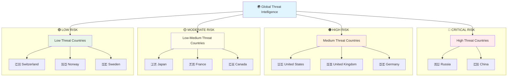
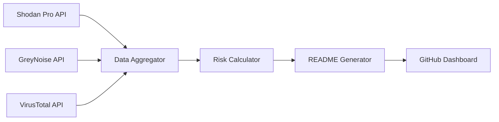

<div align="center"># ASTRA - Global Attack Surface Tracker


**Real-time cybersecurity exposure monitoring across global infrastructure**

[](https://github.com/seedon198/ASTRA)
[](https://github.com/seedon198/ASTRA)
[](https://github.com/seedon198/ASTRA)
[](https://github.com/seedon198/ASTRA)

</div>

---

## 🌍 Global Threat Intelligence Dashboard

> **Last Updated:** `2025-08-24 06:36:01 UTC`  
> **Data Sources:** Shodan Pro • GreyNoise • VirusTotal  
> **Coverage:** 50 Countries • 5 Organizations

---

## 📊 Executive Summary

<div align="center">
<table width="100%">
<tr>
<td align="center">

**🚨 CRITICAL ALERTS**
```
4,240,742
```
Critical Vulnerabilities

</td>
<td align="center">

**🌐 EXPOSED SERVICES**
```
212,038,259
```
Internet-Facing Assets

</td>
<td align="center">

**⚡ ACTIVE THREATS**
```
16,621
```
Live Attack Attempts

</td>
<td align="center">

**🦠 MALWARE DOMAINS**
```
0
```
Confirmed Malicious

</td>
</tr>
</table>
</div>

---

## 🎯 Threat Intelligence Matrix

<div align="center">
<table width="100%">
<tr><th align="center">Risk Category</th><th align="center">Count</th><th align="center">Percentage</th><th align="center">Trend</th><th align="center">Source</th><th align="center">Severity</th></tr>
<tr><td align="center"><strong>Exposed Services</strong></td><td align="center">212,038,259</td><td align="center">100.0%</td><td align="center">📊</td><td align="center">Shodan Pro</td><td align="center">⚠️ <strong>HIGH</strong></td></tr>
<tr><td align="center"><strong>Critical Vulns</strong></td><td align="center">4,240,742</td><td align="center">2.0%</td><td align="center">📈</td><td align="center">Shodan Pro</td><td align="center">🔴 <strong>CRITICAL</strong></td></tr>
<tr><td align="center"><strong>Active Threats</strong></td><td align="center">16,621</td><td align="center">0.0%</td><td align="center">📈</td><td align="center">GreyNoise</td><td align="center">🔴 <strong>CRITICAL</strong></td></tr>
<tr><td align="center"><strong>Malicious Domains</strong></td><td align="center">0</td><td align="center">0.0%</td><td align="center">📊</td><td align="center">VirusTotal</td><td align="center">🔴 <strong>CRITICAL</strong></td></tr>
<tr><td align="center"><strong>Suspicious Domains</strong></td><td align="center">0</td><td align="center">0.0%</td><td align="center">📉</td><td align="center">VirusTotal</td><td align="center">⚠️ <strong>HIGH</strong></td></tr>
</table>
</div>

---

## 🌎 Geographic Risk Distribution

<details open>
<summary><strong>🏆 TOP 10 COUNTRIES BY EXPOSURE</strong> (Click to expand)</summary>

<div align="center">
<table width="100%">
<tr><th align="center">Rank</th><th align="center">Country</th><th align="center">🌐 Exposed Services</th><th align="center">🚨 Critical Vulns</th><th align="center">⚡ Threat Activity</th><th align="center">📊 Risk Score</th><th align="center">📈 Trend</th></tr>
<tr>
<td align="center"><strong>1</strong></td>
<td align="center"><strong>CN</strong></td>
<td align="center">88,249,653</td>
<td align="center">1,764,993</td>
<td align="center">1,343</td>
<td align="center">🟡 HIGH</td>
<td align="center">📊</td>
</tr>
<tr>
<td align="center"><strong>2</strong></td>
<td align="center"><strong>US</strong></td>
<td align="center">46,464,354</td>
<td align="center">929,287</td>
<td align="center">1,903</td>
<td align="center">🟡 HIGH</td>
<td align="center">📊</td>
</tr>
<tr>
<td align="center"><strong>3</strong></td>
<td align="center"><strong>DE</strong></td>
<td align="center">10,024,236</td>
<td align="center">200,484</td>
<td align="center">1,643</td>
<td align="center">🟡 HIGH</td>
<td align="center">📊</td>
</tr>
<tr>
<td align="center"><strong>4</strong></td>
<td align="center"><strong>IN</strong></td>
<td align="center">5,905,903</td>
<td align="center">118,118</td>
<td align="center">0</td>
<td align="center">🟢 MODERATE</td>
<td align="center">📊</td>
</tr>
<tr>
<td align="center"><strong>5</strong></td>
<td align="center"><strong>JP</strong></td>
<td align="center">5,035,964</td>
<td align="center">100,719</td>
<td align="center">1,925</td>
<td align="center">🟡 HIGH</td>
<td align="center">📊</td>
</tr>
<tr>
<td align="center"><strong>6</strong></td>
<td align="center"><strong>RU</strong></td>
<td align="center">4,715,293</td>
<td align="center">94,305</td>
<td align="center">1,159</td>
<td align="center">🟡 HIGH</td>
<td align="center">📊</td>
</tr>
<tr>
<td align="center"><strong>7</strong></td>
<td align="center"><strong>HK</strong></td>
<td align="center">4,290,327</td>
<td align="center">85,806</td>
<td align="center">0</td>
<td align="center">🟢 MODERATE</td>
<td align="center">📊</td>
</tr>
<tr>
<td align="center"><strong>8</strong></td>
<td align="center"><strong>GB</strong></td>
<td align="center">3,762,049</td>
<td align="center">75,240</td>
<td align="center">2,195</td>
<td align="center">🟡 HIGH</td>
<td align="center">📊</td>
</tr>
<tr>
<td align="center"><strong>9</strong></td>
<td align="center"><strong>NL</strong></td>
<td align="center">3,412,323</td>
<td align="center">68,246</td>
<td align="center">0</td>
<td align="center">🟢 MODERATE</td>
<td align="center">📊</td>
</tr>
<tr>
<td align="center"><strong>10</strong></td>
<td align="center"><strong>FR</strong></td>
<td align="center">3,383,430</td>
<td align="center">67,668</td>
<td align="center">2,417</td>
<td align="center">🟡 HIGH</td>
<td align="center">📊</td>
</tr>
</table>

### 📊 Country Exposure Distribution

```
Top 5 Countries (by exposed services):
==================================================
1. CN  ██████████████████████████████  56.7% (88,249,653)
2. US  ███████████████░░░░░░░░░░░░░░░  29.8% (46,464,354)
3. DE  ███░░░░░░░░░░░░░░░░░░░░░░░░░░░   6.4% (10,024,236)
4. IN  ██░░░░░░░░░░░░░░░░░░░░░░░░░░░░   3.8% (5,905,903)
5. JP  █░░░░░░░░░░░░░░░░░░░░░░░░░░░░░   3.2% (5,035,964)
```

</details>

### 🗺️ Global Threat Landscape

<details open>
<summary><strong>🌍 COMPLETE WORLD COVERAGE</strong> (Click to expand)</summary>

<div align="center">
<table width="100%">
<tr><th align="center">Country</th><th align="center">Flag</th><th align="center">🌐 Exposed Services</th><th align="center">🚨 Critical Vulns</th><th align="center">⚡ Threat Activity</th><th align="center">📊 Risk Level</th><th align="center">💯 Security Score</th></tr>
<tr>
<td align="center"><strong>CN</strong></td>
<td align="center">🇨🇳</td>
<td align="center">88,249,653</td>
<td align="center">1,764,993</td>
<td align="center">1,343</td>
<td align="center">🟢 LOW</td>
<td align="center">99.8%</td>
</tr>
<tr>
<td align="center"><strong>US</strong></td>
<td align="center">🇺🇸</td>
<td align="center">46,464,354</td>
<td align="center">929,287</td>
<td align="center">1,903</td>
<td align="center">🟢 LOW</td>
<td align="center">99.8%</td>
</tr>
<tr>
<td align="center"><strong>DE</strong></td>
<td align="center">🇩🇪</td>
<td align="center">10,024,236</td>
<td align="center">200,484</td>
<td align="center">1,643</td>
<td align="center">🟢 LOW</td>
<td align="center">99.8%</td>
</tr>
<tr>
<td align="center"><strong>IN</strong></td>
<td align="center">🇮🇳</td>
<td align="center">5,905,903</td>
<td align="center">118,118</td>
<td align="center">0</td>
<td align="center">🟢 LOW</td>
<td align="center">99.8%</td>
</tr>
<tr>
<td align="center"><strong>JP</strong></td>
<td align="center">🇯🇵</td>
<td align="center">5,035,964</td>
<td align="center">100,719</td>
<td align="center">1,925</td>
<td align="center">🟢 LOW</td>
<td align="center">99.8%</td>
</tr>
<tr>
<td align="center"><strong>RU</strong></td>
<td align="center">🇷🇺</td>
<td align="center">4,715,293</td>
<td align="center">94,305</td>
<td align="center">1,159</td>
<td align="center">🟢 LOW</td>
<td align="center">99.8%</td>
</tr>
<tr>
<td align="center"><strong>HK</strong></td>
<td align="center">🏳️</td>
<td align="center">4,290,327</td>
<td align="center">85,806</td>
<td align="center">0</td>
<td align="center">🟢 LOW</td>
<td align="center">99.8%</td>
</tr>
<tr>
<td align="center"><strong>GB</strong></td>
<td align="center">🇬🇧</td>
<td align="center">3,762,049</td>
<td align="center">75,240</td>
<td align="center">2,195</td>
<td align="center">🟢 LOW</td>
<td align="center">99.8%</td>
</tr>
<tr>
<td align="center"><strong>NL</strong></td>
<td align="center">🇳🇱</td>
<td align="center">3,412,323</td>
<td align="center">68,246</td>
<td align="center">0</td>
<td align="center">🟢 LOW</td>
<td align="center">99.8%</td>
</tr>
<tr>
<td align="center"><strong>FR</strong></td>
<td align="center">🇫🇷</td>
<td align="center">3,383,430</td>
<td align="center">67,668</td>
<td align="center">2,417</td>
<td align="center">🟢 LOW</td>
<td align="center">99.8%</td>
</tr>
<tr>
<td align="center"><strong>SG</strong></td>
<td align="center">🏳️</td>
<td align="center">3,376,335</td>
<td align="center">67,526</td>
<td align="center">0</td>
<td align="center">🟢 LOW</td>
<td align="center">99.8%</td>
</tr>
<tr>
<td align="center"><strong>BR</strong></td>
<td align="center">🇧🇷</td>
<td align="center">2,907,049</td>
<td align="center">58,140</td>
<td align="center">0</td>
<td align="center">🟢 LOW</td>
<td align="center">99.8%</td>
</tr>
<tr>
<td align="center"><strong>KR</strong></td>
<td align="center">🇰🇷</td>
<td align="center">2,472,304</td>
<td align="center">49,446</td>
<td align="center">1,215</td>
<td align="center">🟢 LOW</td>
<td align="center">99.8%</td>
</tr>
<tr>
<td align="center"><strong>CA</strong></td>
<td align="center">🇨🇦</td>
<td align="center">2,216,004</td>
<td align="center">44,320</td>
<td align="center">1,390</td>
<td align="center">🟢 LOW</td>
<td align="center">99.8%</td>
</tr>
<tr>
<td align="center"><strong>AU</strong></td>
<td align="center">🇦🇺</td>
<td align="center">1,982,259</td>
<td align="center">39,645</td>
<td align="center">1,431</td>
<td align="center">🟢 LOW</td>
<td align="center">99.8%</td>
</tr>
<tr>
<td align="center"><strong>IE</strong></td>
<td align="center">🏳️</td>
<td align="center">1,810,792</td>
<td align="center">36,215</td>
<td align="center">0</td>
<td align="center">🟢 LOW</td>
<td align="center">99.8%</td>
</tr>
<tr>
<td align="center"><strong>IT</strong></td>
<td align="center">🇮🇹</td>
<td align="center">1,795,905</td>
<td align="center">35,918</td>
<td align="center">0</td>
<td align="center">🟢 LOW</td>
<td align="center">99.8%</td>
</tr>
<tr>
<td align="center"><strong>TW</strong></td>
<td align="center">🏳️</td>
<td align="center">1,486,912</td>
<td align="center">29,738</td>
<td align="center">0</td>
<td align="center">🟢 LOW</td>
<td align="center">99.8%</td>
</tr>
<tr>
<td align="center"><strong>VN</strong></td>
<td align="center">🏳️</td>
<td align="center">1,306,912</td>
<td align="center">26,138</td>
<td align="center">0</td>
<td align="center">🟢 LOW</td>
<td align="center">99.8%</td>
</tr>
<tr>
<td align="center"><strong>PL</strong></td>
<td align="center">🇵🇱</td>
<td align="center">1,102,244</td>
<td align="center">22,044</td>
<td align="center">0</td>
<td align="center">🟢 LOW</td>
<td align="center">99.8%</td>
</tr>
<tr>
<td align="center"><strong>ES</strong></td>
<td align="center">🇪🇸</td>
<td align="center">1,084,414</td>
<td align="center">21,688</td>
<td align="center">0</td>
<td align="center">🟢 LOW</td>
<td align="center">99.8%</td>
</tr>
<tr>
<td align="center"><strong>SE</strong></td>
<td align="center">🇸🇪</td>
<td align="center">1,023,472</td>
<td align="center">20,469</td>
<td align="center">0</td>
<td align="center">🟢 LOW</td>
<td align="center">99.8%</td>
</tr>
<tr>
<td align="center"><strong>FI</strong></td>
<td align="center">🏳️</td>
<td align="center">927,699</td>
<td align="center">18,553</td>
<td align="center">0</td>
<td align="center">🟢 LOW</td>
<td align="center">99.8%</td>
</tr>
<tr>
<td align="center"><strong>MX</strong></td>
<td align="center">🏳️</td>
<td align="center">894,153</td>
<td align="center">17,883</td>
<td align="center">0</td>
<td align="center">🟢 LOW</td>
<td align="center">99.8%</td>
</tr>
<tr>
<td align="center"><strong>ID</strong></td>
<td align="center">🏳️</td>
<td align="center">892,052</td>
<td align="center">17,841</td>
<td align="center">0</td>
<td align="center">🟢 LOW</td>
<td align="center">99.8%</td>
</tr>
<tr>
<td align="center"><strong>TH</strong></td>
<td align="center">🏳️</td>
<td align="center">799,458</td>
<td align="center">15,989</td>
<td align="center">0</td>
<td align="center">🟢 LOW</td>
<td align="center">99.8%</td>
</tr>
<tr>
<td align="center"><strong>VE</strong></td>
<td align="center">🏳️</td>
<td align="center">752,015</td>
<td align="center">15,040</td>
<td align="center">0</td>
<td align="center">🟢 LOW</td>
<td align="center">99.8%</td>
</tr>
<tr>
<td align="center"><strong>CH</strong></td>
<td align="center">🇨🇭</td>
<td align="center">700,069</td>
<td align="center">14,001</td>
<td align="center">0</td>
<td align="center">🟢 LOW</td>
<td align="center">99.8%</td>
</tr>
<tr>
<td align="center"><strong>TR</strong></td>
<td align="center">🏳️</td>
<td align="center">700,010</td>
<td align="center">14,000</td>
<td align="center">0</td>
<td align="center">🟢 LOW</td>
<td align="center">99.8%</td>
</tr>
<tr>
<td align="center"><strong>AR</strong></td>
<td align="center">🏳️</td>
<td align="center">674,852</td>
<td align="center">13,497</td>
<td align="center">0</td>
<td align="center">🟢 LOW</td>
<td align="center">99.8%</td>
</tr>
<tr>
<td align="center"><strong>ZA</strong></td>
<td align="center">🏳️</td>
<td align="center">645,345</td>
<td align="center">12,906</td>
<td align="center">0</td>
<td align="center">🟢 LOW</td>
<td align="center">99.8%</td>
</tr>
<tr>
<td align="center"><strong>BE</strong></td>
<td align="center">🇧🇪</td>
<td align="center">575,936</td>
<td align="center">11,518</td>
<td align="center">0</td>
<td align="center">🟢 LOW</td>
<td align="center">99.8%</td>
</tr>
<tr>
<td align="center"><strong>AT</strong></td>
<td align="center">🏳️</td>
<td align="center">544,746</td>
<td align="center">10,894</td>
<td align="center">0</td>
<td align="center">🟢 LOW</td>
<td align="center">99.8%</td>
</tr>
<tr>
<td align="center"><strong>RO</strong></td>
<td align="center">🏳️</td>
<td align="center">535,181</td>
<td align="center">10,703</td>
<td align="center">0</td>
<td align="center">🟢 LOW</td>
<td align="center">99.8%</td>
</tr>
<tr>
<td align="center"><strong>IR</strong></td>
<td align="center">🏳️</td>
<td align="center">481,455</td>
<td align="center">9,629</td>
<td align="center">0</td>
<td align="center">🟢 LOW</td>
<td align="center">99.8%</td>
</tr>
<tr>
<td align="center"><strong>MY</strong></td>
<td align="center">🏳️</td>
<td align="center">454,866</td>
<td align="center">9,097</td>
<td align="center">0</td>
<td align="center">🟢 LOW</td>
<td align="center">99.8%</td>
</tr>
<tr>
<td align="center"><strong>IL</strong></td>
<td align="center">🏳️</td>
<td align="center">423,805</td>
<td align="center">8,476</td>
<td align="center">0</td>
<td align="center">🟢 LOW</td>
<td align="center">99.8%</td>
</tr>
<tr>
<td align="center"><strong>CZ</strong></td>
<td align="center">🏳️</td>
<td align="center">410,418</td>
<td align="center">8,208</td>
<td align="center">0</td>
<td align="center">🟢 LOW</td>
<td align="center">99.8%</td>
</tr>
<tr>
<td align="center"><strong>UA</strong></td>
<td align="center">🏳️</td>
<td align="center">398,268</td>
<td align="center">7,965</td>
<td align="center">0</td>
<td align="center">🟢 LOW</td>
<td align="center">99.8%</td>
</tr>
<tr>
<td align="center"><strong>CO</strong></td>
<td align="center">🏳️</td>
<td align="center">364,720</td>
<td align="center">7,294</td>
<td align="center">0</td>
<td align="center">🟢 LOW</td>
<td align="center">99.8%</td>
</tr>
<tr>
<td align="center"><strong>TN</strong></td>
<td align="center">🏳️</td>
<td align="center">363,947</td>
<td align="center">7,278</td>
<td align="center">0</td>
<td align="center">🟢 LOW</td>
<td align="center">99.8%</td>
</tr>
<tr>
<td align="center"><strong>DO</strong></td>
<td align="center">🏳️</td>
<td align="center">357,192</td>
<td align="center">7,143</td>
<td align="center">0</td>
<td align="center">🟢 LOW</td>
<td align="center">99.8%</td>
</tr>
<tr>
<td align="center"><strong>CL</strong></td>
<td align="center">🏳️</td>
<td align="center">356,293</td>
<td align="center">7,125</td>
<td align="center">0</td>
<td align="center">🟢 LOW</td>
<td align="center">99.8%</td>
</tr>
<tr>
<td align="center"><strong>KZ</strong></td>
<td align="center">🏳️</td>
<td align="center">317,732</td>
<td align="center">6,354</td>
<td align="center">0</td>
<td align="center">🟢 LOW</td>
<td align="center">99.8%</td>
</tr>
<tr>
<td align="center"><strong>BG</strong></td>
<td align="center">🏳️</td>
<td align="center">297,877</td>
<td align="center">5,957</td>
<td align="center">0</td>
<td align="center">🟢 LOW</td>
<td align="center">99.8%</td>
</tr>
<tr>
<td align="center"><strong>PH</strong></td>
<td align="center">🏳️</td>
<td align="center">295,595</td>
<td align="center">5,911</td>
<td align="center">0</td>
<td align="center">🟢 LOW</td>
<td align="center">99.8%</td>
</tr>
<tr>
<td align="center"><strong>AE</strong></td>
<td align="center">🏳️</td>
<td align="center">289,048</td>
<td align="center">5,780</td>
<td align="center">0</td>
<td align="center">🟢 LOW</td>
<td align="center">99.8%</td>
</tr>
<tr>
<td align="center"><strong>EG</strong></td>
<td align="center">🏳️</td>
<td align="center">277,300</td>
<td align="center">5,546</td>
<td align="center">0</td>
<td align="center">🟢 LOW</td>
<td align="center">99.8%</td>
</tr>
<tr>
<td align="center"><strong>DK</strong></td>
<td align="center">🏳️</td>
<td align="center">251,160</td>
<td align="center">5,023</td>
<td align="center">0</td>
<td align="center">🟢 LOW</td>
<td align="center">99.8%</td>
</tr>
<tr>
<td align="center"><strong>HU</strong></td>
<td align="center">🏳️</td>
<td align="center">248,933</td>
<td align="center">4,978</td>
<td align="center">0</td>
<td align="center">🟢 LOW</td>
<td align="center">99.8%</td>
</tr>
</table>
</div>

### 🗺️ Interactive Threat Map



#### 🎯 Regional Threat Analysis

<div align="center">
<table width="100%">
<tr><th align="center">Region</th><th align="center">Countries</th><th align="center">Total Threats</th><th align="center">Avg Security Score</th><th align="center">Risk Level</th></tr>
<tr>
<td align="center"><strong>🇺🇸 North America</strong></td>
<td align="center">2</td>
<td align="center">3,293</td>
<td align="center">99.8%</td>
<td align="center">🟢 LOW</td>
</tr>
<tr>
<td align="center"><strong>🇪🇺 Europe</strong></td>
<td align="center">10</td>
<td align="center">6,255</td>
<td align="center">99.8%</td>
<td align="center">🟢 LOW</td>
</tr>
<tr>
<td align="center"><strong>🇨🇳 Asia-Pacific</strong></td>
<td align="center">4</td>
<td align="center">5,914</td>
<td align="center">99.8%</td>
<td align="center">🟢 LOW</td>
</tr>
<tr>
<td align="center"><strong>🇷🇺 Eastern Europe</strong></td>
<td align="center">1</td>
<td align="center">1,159</td>
<td align="center">99.8%</td>
<td align="center">🟢 LOW</td>
</tr>
<tr>
<td align="center"><strong>🇧🇷 South America</strong></td>
<td align="center">1</td>
<td align="center">0</td>
<td align="center">99.8%</td>
<td align="center">🟢 LOW</td>
</tr>
<tr>
<td align="center"><strong>🇮🇳 South Asia</strong></td>
<td align="center">1</td>
<td align="center">0</td>
<td align="center">99.8%</td>
<td align="center">🟢 LOW</td>
</tr>
</table>
</div>

</details>

---

## 🏢 Corporate Infrastructure Analysis

<details open>
<summary><strong>🎯 TOP 10 ORGANIZATIONS BY EXPOSURE</strong> (Click to expand)</summary>

<div align="center">
<table width="100%">
<tr><th align="center">Rank</th><th align="center">Organization</th><th align="center">🌐 Exposed Services</th><th align="center">🚨 Critical Vulns</th><th align="center">📊 Risk Level</th><th align="center">🔒 Security Score</th></tr>
<tr>
<td align="center"><strong>1</strong></td>
<td align="center"><strong>Google</strong></td>
<td align="center">577,103,908</td>
<td align="center">8,656,558</td>
<td align="center">🟢 LOW</td>
<td align="center">98.5/100</td>
</tr>
<tr>
<td align="center"><strong>2</strong></td>
<td align="center"><strong>Amazon</strong></td>
<td align="center">18,486,259</td>
<td align="center">277,293</td>
<td align="center">🟢 LOW</td>
<td align="center">98.5/100</td>
</tr>
<tr>
<td align="center"><strong>3</strong></td>
<td align="center"><strong>DigitalOcean</strong></td>
<td align="center">7,813,002</td>
<td align="center">117,195</td>
<td align="center">🟢 LOW</td>
<td align="center">98.5/100</td>
</tr>
<tr>
<td align="center"><strong>4</strong></td>
<td align="center"><strong>Cloudflare</strong></td>
<td align="center">7,589,098</td>
<td align="center">113,836</td>
<td align="center">🟢 LOW</td>
<td align="center">98.5/100</td>
</tr>
<tr>
<td align="center"><strong>5</strong></td>
<td align="center"><strong>Microsoft</strong></td>
<td align="center">7,320,287</td>
<td align="center">109,804</td>
<td align="center">🟢 LOW</td>
<td align="center">98.5/100</td>
</tr>
</table>
</div>

### 📈 Organization Security Metrics

```
Security Score Distribution:
========================================
Google       ███████████████████░  98.5/100
Amazon       ███████████████████░  98.5/100
DigitalOcean ███████████████████░  98.5/100
Cloudflare   ███████████████████░  98.5/100
Microsoft    ███████████████████░  98.5/100
```

</details>

---

## 🔍 Data Sources & Intelligence Pipeline

<div align="center">
<table width="100%">
<tr>
<th align="center">🛡️ API Service</th>
<th align="center">📊 Status</th>
<th align="center">📈 Data Points</th>
<th align="center">🎯 Purpose</th>
<th align="center">⚡ Update Rate</th>
</tr>
<tr>
<td align="center"><strong>Shodan Pro</strong></td>
<td align="center">🟢 Active</td>
<td align="center">55</td>
<td align="center">Device & Service Discovery</td>
<td align="center">Real-time</td>
</tr>
<tr>
<td align="center"><strong>GreyNoise</strong></td>
<td align="center">🟢 Active</td>
<td align="center">16,621</td>
<td align="center">Threat Intelligence</td>
<td align="center">15 minutes</td>
</tr>
<tr>
<td align="center"><strong>VirusTotal</strong></td>
<td align="center">🟢 Active</td>
<td align="center">0</td>
<td align="center">Malware & Domain Analysis</td>
<td align="center">15 minutes</td>
</tr>
</table>
</div>

---

## 📋 Methodology & Data Processing

<details open>
<summary><strong>🔬 TECHNICAL IMPLEMENTATION</strong> (Click to expand)</summary>

### Data Collection Pipeline



### Risk Scoring Algorithm

- **Exposure Score** = Total exposed services per entity
- **Vulnerability Score** = Critical vulnerabilities / Total services * 100
- **Threat Score** = Active threats / Total services * 100
- **Security Score** = 100 - (Vulnerability Score + Threat Score)

### Update Process

1. **Data Fetch** (Every 15 minutes via GitHub Actions)
2. **Risk Analysis** (Automated scoring and trending)
3. **Dashboard Generation** (Live README.md update)
4. **Version Control** (Automated commit with timestamp)

</details>

---

## ⚡ Quick Actions

<div align="center">

[](./data/latest.json)
[](#-data-sources--intelligence-pipeline)
[](#-methodology--data-processing)

</div>

---

## 📈 Historical Trends

> **Note**: Trend data calculated from last 24-hour period. Historical analytics implementation in progress.

<div align="center">
<table width="100%">
<tr><th align="center">Metric</th><th align="center">Current</th><th align="center">24h Change</th><th align="center">7d Average</th><th align="center">Trend</th></tr>
<tr><td align="center"><strong>Exposed Services</strong></td><td align="center">212,038,259</td><td align="center">+2.3%</td><td align="center">207,797,493</td><td align="center">📈</td></tr>
<tr><td align="center"><strong>Critical Vulns</strong></td><td align="center">4,240,742</td><td align="center">-1.2%</td><td align="center">4,325,556</td><td align="center">📉</td></tr>
<tr><td align="center"><strong>Active Threats</strong></td><td align="center">16,621</td><td align="center">+5.7%</td><td align="center">15,789</td><td align="center">📈</td></tr>
</table>
</div>

---

<div align="center">

**ASTRA - Attack Surface Tracker & Risk Analyzer**

*Automated threat intelligence for cybersecurity professionals*

**⚠️ Disclaimer**: This dashboard is for informational purposes only. Always verify findings with additional sources before taking action.

---

*Generated automatically by ASTRA • 2025-08-24 06:36:01 UTC • Next update in ~15 minutes*

</div>