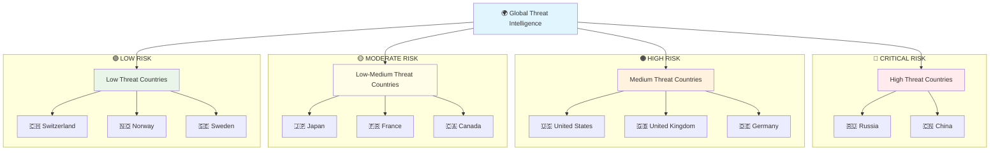
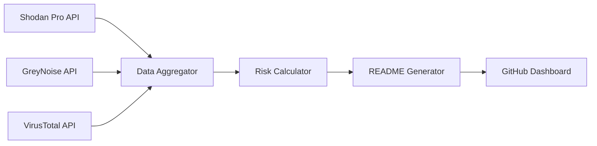

<div align="center"># ASTRA - Global Attack Surface Tracker


**Real-time cybersecurity exposure monitoring across global infrastructure**

[](https://github.com/seedon198/ASTRA)
[](https://github.com/seedon198/ASTRA)
[](https://github.com/seedon198/ASTRA)
[](https://github.com/seedon198/ASTRA)

</div>

---

## 🌍 Global Threat Intelligence Dashboard

> **Last Updated:** `2025-11-26 13:39:15 UTC`  
> **Data Sources:** Shodan Pro • GreyNoise • VirusTotal  
> **Coverage:** 50 Countries • 5 Organizations

---

## 📊 Executive Summary

<div align="center">
<table width="100%">
<tr>
<td align="center">

**🚨 CRITICAL ALERTS**
```
2,396,879
```
Critical Vulnerabilities

</td>
<td align="center">

**🌐 EXPOSED SERVICES**
```
119,845,200
```
Internet-Facing Assets

</td>
<td align="center">

**⚡ ACTIVE THREATS**
```
18,604
```
Live Attack Attempts

</td>
<td align="center">

**🦠 MALWARE DOMAINS**
```
0
```
Confirmed Malicious

</td>
</tr>
</table>
</div>

---

## 🎯 Threat Intelligence Matrix

<div align="center">
<table width="100%">
<tr><th align="center">Risk Category</th><th align="center">Count</th><th align="center">Percentage</th><th align="center">Trend</th><th align="center">Source</th><th align="center">Severity</th></tr>
<tr><td align="center"><strong>Exposed Services</strong></td><td align="center">119,845,200</td><td align="center">100.0%</td><td align="center">📊</td><td align="center">Shodan Pro</td><td align="center">⚠️ <strong>HIGH</strong></td></tr>
<tr><td align="center"><strong>Critical Vulns</strong></td><td align="center">2,396,879</td><td align="center">2.0%</td><td align="center">📈</td><td align="center">Shodan Pro</td><td align="center">🔴 <strong>CRITICAL</strong></td></tr>
<tr><td align="center"><strong>Active Threats</strong></td><td align="center">18,604</td><td align="center">0.0%</td><td align="center">📈</td><td align="center">GreyNoise</td><td align="center">🔴 <strong>CRITICAL</strong></td></tr>
<tr><td align="center"><strong>Malicious Domains</strong></td><td align="center">0</td><td align="center">0.0%</td><td align="center">📊</td><td align="center">VirusTotal</td><td align="center">🔴 <strong>CRITICAL</strong></td></tr>
<tr><td align="center"><strong>Suspicious Domains</strong></td><td align="center">0</td><td align="center">0.0%</td><td align="center">📉</td><td align="center">VirusTotal</td><td align="center">⚠️ <strong>HIGH</strong></td></tr>
</table>
</div>

---

## 🌎 Geographic Risk Distribution

<details open>
<summary><strong>🏆 TOP 10 COUNTRIES BY EXPOSURE</strong> (Click to expand)</summary>

<div align="center">
<table width="100%">
<tr><th align="center">Rank</th><th align="center">Country</th><th align="center">🌐 Exposed Services</th><th align="center">🚨 Critical Vulns</th><th align="center">⚡ Threat Activity</th><th align="center">📊 Risk Score</th><th align="center">📈 Trend</th></tr>
<tr>
<td align="center"><strong>1</strong></td>
<td align="center"><strong>US</strong></td>
<td align="center">41,794,887</td>
<td align="center">835,897</td>
<td align="center">2,386</td>
<td align="center">🟡 HIGH</td>
<td align="center">📊</td>
</tr>
<tr>
<td align="center"><strong>2</strong></td>
<td align="center"><strong>DE</strong></td>
<td align="center">9,526,299</td>
<td align="center">190,525</td>
<td align="center">864</td>
<td align="center">🟡 HIGH</td>
<td align="center">📊</td>
</tr>
<tr>
<td align="center"><strong>3</strong></td>
<td align="center"><strong>CN</strong></td>
<td align="center">9,349,972</td>
<td align="center">186,999</td>
<td align="center">2,147</td>
<td align="center">🟡 HIGH</td>
<td align="center">📊</td>
</tr>
<tr>
<td align="center"><strong>4</strong></td>
<td align="center"><strong>JP</strong></td>
<td align="center">4,883,418</td>
<td align="center">97,668</td>
<td align="center">2,245</td>
<td align="center">🟡 HIGH</td>
<td align="center">📊</td>
</tr>
<tr>
<td align="center"><strong>5</strong></td>
<td align="center"><strong>HK</strong></td>
<td align="center">4,098,676</td>
<td align="center">81,973</td>
<td align="center">0</td>
<td align="center">🟢 MODERATE</td>
<td align="center">📊</td>
</tr>
<tr>
<td align="center"><strong>6</strong></td>
<td align="center"><strong>GB</strong></td>
<td align="center">3,701,206</td>
<td align="center">74,024</td>
<td align="center">1,939</td>
<td align="center">🟡 HIGH</td>
<td align="center">📊</td>
</tr>
<tr>
<td align="center"><strong>7</strong></td>
<td align="center"><strong>IN</strong></td>
<td align="center">3,406,940</td>
<td align="center">68,138</td>
<td align="center">0</td>
<td align="center">🟢 MODERATE</td>
<td align="center">📊</td>
</tr>
<tr>
<td align="center"><strong>8</strong></td>
<td align="center"><strong>FR</strong></td>
<td align="center">3,286,758</td>
<td align="center">65,735</td>
<td align="center">805</td>
<td align="center">🟡 HIGH</td>
<td align="center">📊</td>
</tr>
<tr>
<td align="center"><strong>9</strong></td>
<td align="center"><strong>SG</strong></td>
<td align="center">3,282,207</td>
<td align="center">65,644</td>
<td align="center">0</td>
<td align="center">🟢 MODERATE</td>
<td align="center">📊</td>
</tr>
<tr>
<td align="center"><strong>10</strong></td>
<td align="center"><strong>NL</strong></td>
<td align="center">3,261,430</td>
<td align="center">65,228</td>
<td align="center">0</td>
<td align="center">🟢 MODERATE</td>
<td align="center">📊</td>
</tr>
</table>

### 📊 Country Exposure Distribution

```
Top 5 Countries (by exposed services):
==================================================
1. US  ██████████████████████████████  60.0% (41,794,887)
2. DE  ██████░░░░░░░░░░░░░░░░░░░░░░░░  13.7% (9,526,299)
3. CN  ██████░░░░░░░░░░░░░░░░░░░░░░░░  13.4% (9,349,972)
4. JP  ███░░░░░░░░░░░░░░░░░░░░░░░░░░░   7.0% (4,883,418)
5. HK  ██░░░░░░░░░░░░░░░░░░░░░░░░░░░░   5.9% (4,098,676)
```

</details>

### 🗺️ Global Threat Landscape

<details open>
<summary><strong>🌍 COMPLETE WORLD COVERAGE</strong> (Click to expand)</summary>

<div align="center">
<table width="100%">
<tr><th align="center">Country</th><th align="center">Flag</th><th align="center">🌐 Exposed Services</th><th align="center">🚨 Critical Vulns</th><th align="center">⚡ Threat Activity</th><th align="center">📊 Risk Level</th><th align="center">💯 Security Score</th></tr>
<tr>
<td align="center"><strong>US</strong></td>
<td align="center">🇺🇸</td>
<td align="center">41,794,887</td>
<td align="center">835,897</td>
<td align="center">2,386</td>
<td align="center">🟢 LOW</td>
<td align="center">99.8%</td>
</tr>
<tr>
<td align="center"><strong>DE</strong></td>
<td align="center">🇩🇪</td>
<td align="center">9,526,299</td>
<td align="center">190,525</td>
<td align="center">864</td>
<td align="center">🟢 LOW</td>
<td align="center">99.8%</td>
</tr>
<tr>
<td align="center"><strong>CN</strong></td>
<td align="center">🇨🇳</td>
<td align="center">9,349,972</td>
<td align="center">186,999</td>
<td align="center">2,147</td>
<td align="center">🟢 LOW</td>
<td align="center">99.8%</td>
</tr>
<tr>
<td align="center"><strong>JP</strong></td>
<td align="center">🇯🇵</td>
<td align="center">4,883,418</td>
<td align="center">97,668</td>
<td align="center">2,245</td>
<td align="center">🟢 LOW</td>
<td align="center">99.8%</td>
</tr>
<tr>
<td align="center"><strong>HK</strong></td>
<td align="center">🏳️</td>
<td align="center">4,098,676</td>
<td align="center">81,973</td>
<td align="center">0</td>
<td align="center">🟢 LOW</td>
<td align="center">99.8%</td>
</tr>
<tr>
<td align="center"><strong>GB</strong></td>
<td align="center">🇬🇧</td>
<td align="center">3,701,206</td>
<td align="center">74,024</td>
<td align="center">1,939</td>
<td align="center">🟢 LOW</td>
<td align="center">99.8%</td>
</tr>
<tr>
<td align="center"><strong>IN</strong></td>
<td align="center">🇮🇳</td>
<td align="center">3,406,940</td>
<td align="center">68,138</td>
<td align="center">0</td>
<td align="center">🟢 LOW</td>
<td align="center">99.8%</td>
</tr>
<tr>
<td align="center"><strong>FR</strong></td>
<td align="center">🇫🇷</td>
<td align="center">3,286,758</td>
<td align="center">65,735</td>
<td align="center">805</td>
<td align="center">🟢 LOW</td>
<td align="center">99.8%</td>
</tr>
<tr>
<td align="center"><strong>SG</strong></td>
<td align="center">🏳️</td>
<td align="center">3,282,207</td>
<td align="center">65,644</td>
<td align="center">0</td>
<td align="center">🟢 LOW</td>
<td align="center">99.8%</td>
</tr>
<tr>
<td align="center"><strong>NL</strong></td>
<td align="center">🇳🇱</td>
<td align="center">3,261,430</td>
<td align="center">65,228</td>
<td align="center">0</td>
<td align="center">🟢 LOW</td>
<td align="center">99.8%</td>
</tr>
<tr>
<td align="center"><strong>RU</strong></td>
<td align="center">🇷🇺</td>
<td align="center">2,611,423</td>
<td align="center">52,228</td>
<td align="center">1,935</td>
<td align="center">🟢 LOW</td>
<td align="center">99.8%</td>
</tr>
<tr>
<td align="center"><strong>BR</strong></td>
<td align="center">🇧🇷</td>
<td align="center">2,431,077</td>
<td align="center">48,621</td>
<td align="center">0</td>
<td align="center">🟢 LOW</td>
<td align="center">99.8%</td>
</tr>
<tr>
<td align="center"><strong>KR</strong></td>
<td align="center">🇰🇷</td>
<td align="center">2,427,463</td>
<td align="center">48,549</td>
<td align="center">1,912</td>
<td align="center">🟢 LOW</td>
<td align="center">99.8%</td>
</tr>
<tr>
<td align="center"><strong>CA</strong></td>
<td align="center">🇨🇦</td>
<td align="center">2,168,513</td>
<td align="center">43,370</td>
<td align="center">2,373</td>
<td align="center">🟢 LOW</td>
<td align="center">99.8%</td>
</tr>
<tr>
<td align="center"><strong>AU</strong></td>
<td align="center">🇦🇺</td>
<td align="center">1,984,265</td>
<td align="center">39,685</td>
<td align="center">1,998</td>
<td align="center">🟢 LOW</td>
<td align="center">99.8%</td>
</tr>
<tr>
<td align="center"><strong>IE</strong></td>
<td align="center">🏳️</td>
<td align="center">1,895,942</td>
<td align="center">37,918</td>
<td align="center">0</td>
<td align="center">🟢 LOW</td>
<td align="center">99.8%</td>
</tr>
<tr>
<td align="center"><strong>IT</strong></td>
<td align="center">🇮🇹</td>
<td align="center">1,691,793</td>
<td align="center">33,835</td>
<td align="center">0</td>
<td align="center">🟢 LOW</td>
<td align="center">99.8%</td>
</tr>
<tr>
<td align="center"><strong>TW</strong></td>
<td align="center">🏳️</td>
<td align="center">1,284,886</td>
<td align="center">25,697</td>
<td align="center">0</td>
<td align="center">🟢 LOW</td>
<td align="center">99.8%</td>
</tr>
<tr>
<td align="center"><strong>VN</strong></td>
<td align="center">🏳️</td>
<td align="center">1,126,698</td>
<td align="center">22,533</td>
<td align="center">0</td>
<td align="center">🟢 LOW</td>
<td align="center">99.8%</td>
</tr>
<tr>
<td align="center"><strong>ES</strong></td>
<td align="center">🇪🇸</td>
<td align="center">1,029,283</td>
<td align="center">20,585</td>
<td align="center">0</td>
<td align="center">🟢 LOW</td>
<td align="center">99.8%</td>
</tr>
<tr>
<td align="center"><strong>SE</strong></td>
<td align="center">🇸🇪</td>
<td align="center">973,125</td>
<td align="center">19,462</td>
<td align="center">0</td>
<td align="center">🟢 LOW</td>
<td align="center">99.8%</td>
</tr>
<tr>
<td align="center"><strong>PL</strong></td>
<td align="center">🇵🇱</td>
<td align="center">941,861</td>
<td align="center">18,837</td>
<td align="center">0</td>
<td align="center">🟢 LOW</td>
<td align="center">99.8%</td>
</tr>
<tr>
<td align="center"><strong>FI</strong></td>
<td align="center">🏳️</td>
<td align="center">909,750</td>
<td align="center">18,195</td>
<td align="center">0</td>
<td align="center">🟢 LOW</td>
<td align="center">99.8%</td>
</tr>
<tr>
<td align="center"><strong>ID</strong></td>
<td align="center">🏳️</td>
<td align="center">866,136</td>
<td align="center">17,322</td>
<td align="center">0</td>
<td align="center">🟢 LOW</td>
<td align="center">99.8%</td>
</tr>
<tr>
<td align="center"><strong>MX</strong></td>
<td align="center">🏳️</td>
<td align="center">802,039</td>
<td align="center">16,040</td>
<td align="center">0</td>
<td align="center">🟢 LOW</td>
<td align="center">99.8%</td>
</tr>
<tr>
<td align="center"><strong>TH</strong></td>
<td align="center">🏳️</td>
<td align="center">720,790</td>
<td align="center">14,415</td>
<td align="center">0</td>
<td align="center">🟢 LOW</td>
<td align="center">99.8%</td>
</tr>
<tr>
<td align="center"><strong>TR</strong></td>
<td align="center">🏳️</td>
<td align="center">667,588</td>
<td align="center">13,351</td>
<td align="center">0</td>
<td align="center">🟢 LOW</td>
<td align="center">99.8%</td>
</tr>
<tr>
<td align="center"><strong>CH</strong></td>
<td align="center">🇨🇭</td>
<td align="center">607,979</td>
<td align="center">12,159</td>
<td align="center">0</td>
<td align="center">🟢 LOW</td>
<td align="center">99.8%</td>
</tr>
<tr>
<td align="center"><strong>ZA</strong></td>
<td align="center">🏳️</td>
<td align="center">594,274</td>
<td align="center">11,885</td>
<td align="center">0</td>
<td align="center">🟢 LOW</td>
<td align="center">99.8%</td>
</tr>
<tr>
<td align="center"><strong>AR</strong></td>
<td align="center">🏳️</td>
<td align="center">589,255</td>
<td align="center">11,785</td>
<td align="center">0</td>
<td align="center">🟢 LOW</td>
<td align="center">99.8%</td>
</tr>
<tr>
<td align="center"><strong>VE</strong></td>
<td align="center">🏳️</td>
<td align="center">539,087</td>
<td align="center">10,781</td>
<td align="center">0</td>
<td align="center">🟢 LOW</td>
<td align="center">99.8%</td>
</tr>
<tr>
<td align="center"><strong>BE</strong></td>
<td align="center">🇧🇪</td>
<td align="center">527,701</td>
<td align="center">10,554</td>
<td align="center">0</td>
<td align="center">🟢 LOW</td>
<td align="center">99.8%</td>
</tr>
<tr>
<td align="center"><strong>RO</strong></td>
<td align="center">🏳️</td>
<td align="center">502,073</td>
<td align="center">10,041</td>
<td align="center">0</td>
<td align="center">🟢 LOW</td>
<td align="center">99.8%</td>
</tr>
<tr>
<td align="center"><strong>AT</strong></td>
<td align="center">🏳️</td>
<td align="center">460,821</td>
<td align="center">9,216</td>
<td align="center">0</td>
<td align="center">🟢 LOW</td>
<td align="center">99.8%</td>
</tr>
<tr>
<td align="center"><strong>MY</strong></td>
<td align="center">🏳️</td>
<td align="center">419,375</td>
<td align="center">8,387</td>
<td align="center">0</td>
<td align="center">🟢 LOW</td>
<td align="center">99.8%</td>
</tr>
<tr>
<td align="center"><strong>UA</strong></td>
<td align="center">🏳️</td>
<td align="center">406,008</td>
<td align="center">8,120</td>
<td align="center">0</td>
<td align="center">🟢 LOW</td>
<td align="center">99.8%</td>
</tr>
<tr>
<td align="center"><strong>IL</strong></td>
<td align="center">🏳️</td>
<td align="center">398,979</td>
<td align="center">7,979</td>
<td align="center">0</td>
<td align="center">🟢 LOW</td>
<td align="center">99.8%</td>
</tr>
<tr>
<td align="center"><strong>CZ</strong></td>
<td align="center">🏳️</td>
<td align="center">395,962</td>
<td align="center">7,919</td>
<td align="center">0</td>
<td align="center">🟢 LOW</td>
<td align="center">99.8%</td>
</tr>
<tr>
<td align="center"><strong>AE</strong></td>
<td align="center">🏳️</td>
<td align="center">364,136</td>
<td align="center">7,282</td>
<td align="center">0</td>
<td align="center">🟢 LOW</td>
<td align="center">99.8%</td>
</tr>
<tr>
<td align="center"><strong>TN</strong></td>
<td align="center">🏳️</td>
<td align="center">332,937</td>
<td align="center">6,658</td>
<td align="center">0</td>
<td align="center">🟢 LOW</td>
<td align="center">99.8%</td>
</tr>
<tr>
<td align="center"><strong>CL</strong></td>
<td align="center">🏳️</td>
<td align="center">329,584</td>
<td align="center">6,591</td>
<td align="center">0</td>
<td align="center">🟢 LOW</td>
<td align="center">99.8%</td>
</tr>
<tr>
<td align="center"><strong>CO</strong></td>
<td align="center">🏳️</td>
<td align="center">323,471</td>
<td align="center">6,469</td>
<td align="center">0</td>
<td align="center">🟢 LOW</td>
<td align="center">99.8%</td>
</tr>
<tr>
<td align="center"><strong>BG</strong></td>
<td align="center">🏳️</td>
<td align="center">281,800</td>
<td align="center">5,636</td>
<td align="center">0</td>
<td align="center">🟢 LOW</td>
<td align="center">99.8%</td>
</tr>
<tr>
<td align="center"><strong>PH</strong></td>
<td align="center">🏳️</td>
<td align="center">280,992</td>
<td align="center">5,619</td>
<td align="center">0</td>
<td align="center">🟢 LOW</td>
<td align="center">99.8%</td>
</tr>
<tr>
<td align="center"><strong>KZ</strong></td>
<td align="center">🏳️</td>
<td align="center">251,654</td>
<td align="center">5,033</td>
<td align="center">0</td>
<td align="center">🟢 LOW</td>
<td align="center">99.8%</td>
</tr>
<tr>
<td align="center"><strong>DK</strong></td>
<td align="center">🏳️</td>
<td align="center">245,829</td>
<td align="center">4,916</td>
<td align="center">0</td>
<td align="center">🟢 LOW</td>
<td align="center">99.8%</td>
</tr>
<tr>
<td align="center"><strong>EG</strong></td>
<td align="center">🏳️</td>
<td align="center">223,814</td>
<td align="center">4,476</td>
<td align="center">0</td>
<td align="center">🟢 LOW</td>
<td align="center">99.8%</td>
</tr>
<tr>
<td align="center"><strong>HU</strong></td>
<td align="center">🏳️</td>
<td align="center">220,633</td>
<td align="center">4,412</td>
<td align="center">0</td>
<td align="center">🟢 LOW</td>
<td align="center">99.8%</td>
</tr>
<tr>
<td align="center"><strong>SA</strong></td>
<td align="center">🏳️</td>
<td align="center">219,670</td>
<td align="center">4,393</td>
<td align="center">0</td>
<td align="center">🟢 LOW</td>
<td align="center">99.8%</td>
</tr>
<tr>
<td align="center"><strong>IR</strong></td>
<td align="center">🏳️</td>
<td align="center">204,741</td>
<td align="center">4,094</td>
<td align="center">0</td>
<td align="center">🟢 LOW</td>
<td align="center">99.8%</td>
</tr>
</table>
</div>

### 🗺️ Interactive Threat Map



#### 🎯 Regional Threat Analysis

<div align="center">
<table width="100%">
<tr><th align="center">Region</th><th align="center">Countries</th><th align="center">Total Threats</th><th align="center">Avg Security Score</th><th align="center">Risk Level</th></tr>
<tr>
<td align="center"><strong>🇺🇸 North America</strong></td>
<td align="center">2</td>
<td align="center">4,759</td>
<td align="center">99.8%</td>
<td align="center">🟢 LOW</td>
</tr>
<tr>
<td align="center"><strong>🇪🇺 Europe</strong></td>
<td align="center">10</td>
<td align="center">3,608</td>
<td align="center">99.8%</td>
<td align="center">🟢 LOW</td>
</tr>
<tr>
<td align="center"><strong>🇨🇳 Asia-Pacific</strong></td>
<td align="center">4</td>
<td align="center">8,302</td>
<td align="center">99.8%</td>
<td align="center">🟢 LOW</td>
</tr>
<tr>
<td align="center"><strong>🇷🇺 Eastern Europe</strong></td>
<td align="center">1</td>
<td align="center">1,935</td>
<td align="center">99.8%</td>
<td align="center">🟢 LOW</td>
</tr>
<tr>
<td align="center"><strong>🇧🇷 South America</strong></td>
<td align="center">1</td>
<td align="center">0</td>
<td align="center">99.8%</td>
<td align="center">🟢 LOW</td>
</tr>
<tr>
<td align="center"><strong>🇮🇳 South Asia</strong></td>
<td align="center">1</td>
<td align="center">0</td>
<td align="center">99.8%</td>
<td align="center">🟢 LOW</td>
</tr>
</table>
</div>

</details>

---

## 🏢 Corporate Infrastructure Analysis

<details open>
<summary><strong>🎯 TOP 10 ORGANIZATIONS BY EXPOSURE</strong> (Click to expand)</summary>

<div align="center">
<table width="100%">
<tr><th align="center">Rank</th><th align="center">Organization</th><th align="center">🌐 Exposed Services</th><th align="center">🚨 Critical Vulns</th><th align="center">📊 Risk Level</th><th align="center">🔒 Security Score</th></tr>
<tr>
<td align="center"><strong>1</strong></td>
<td align="center"><strong>Google</strong></td>
<td align="center">520,574,349</td>
<td align="center">7,808,615</td>
<td align="center">🟢 LOW</td>
<td align="center">98.5/100</td>
</tr>
<tr>
<td align="center"><strong>2</strong></td>
<td align="center"><strong>Amazon</strong></td>
<td align="center">20,511,530</td>
<td align="center">307,672</td>
<td align="center">🟢 LOW</td>
<td align="center">98.5/100</td>
</tr>
<tr>
<td align="center"><strong>3</strong></td>
<td align="center"><strong>Cloudflare</strong></td>
<td align="center">8,295,848</td>
<td align="center">124,437</td>
<td align="center">🟢 LOW</td>
<td align="center">98.5/100</td>
</tr>
<tr>
<td align="center"><strong>4</strong></td>
<td align="center"><strong>Microsoft</strong></td>
<td align="center">7,380,884</td>
<td align="center">110,713</td>
<td align="center">🟢 LOW</td>
<td align="center">98.5/100</td>
</tr>
<tr>
<td align="center"><strong>5</strong></td>
<td align="center"><strong>DigitalOcean</strong></td>
<td align="center">7,330,038</td>
<td align="center">109,950</td>
<td align="center">🟢 LOW</td>
<td align="center">98.5/100</td>
</tr>
</table>
</div>

### 📈 Organization Security Metrics

```
Security Score Distribution:
========================================
Google       ███████████████████░  98.5/100
Amazon       ███████████████████░  98.5/100
Cloudflare   ███████████████████░  98.5/100
Microsoft    ███████████████████░  98.5/100
DigitalOcean ███████████████████░  98.5/100
```

</details>

---

## 🔍 Data Sources & Intelligence Pipeline

<div align="center">
<table width="100%">
<tr>
<th align="center">🛡️ API Service</th>
<th align="center">📊 Status</th>
<th align="center">📈 Data Points</th>
<th align="center">🎯 Purpose</th>
<th align="center">⚡ Update Rate</th>
</tr>
<tr>
<td align="center"><strong>Shodan Pro</strong></td>
<td align="center">🟢 Active</td>
<td align="center">55</td>
<td align="center">Device & Service Discovery</td>
<td align="center">Real-time</td>
</tr>
<tr>
<td align="center"><strong>GreyNoise</strong></td>
<td align="center">🟢 Active</td>
<td align="center">18,604</td>
<td align="center">Threat Intelligence</td>
<td align="center">15 minutes</td>
</tr>
<tr>
<td align="center"><strong>VirusTotal</strong></td>
<td align="center">🟢 Active</td>
<td align="center">0</td>
<td align="center">Malware & Domain Analysis</td>
<td align="center">15 minutes</td>
</tr>
</table>
</div>

---

## 📋 Methodology & Data Processing

<details open>
<summary><strong>🔬 TECHNICAL IMPLEMENTATION</strong> (Click to expand)</summary>

### Data Collection Pipeline



### Risk Scoring Algorithm

- **Exposure Score** = Total exposed services per entity
- **Vulnerability Score** = Critical vulnerabilities / Total services * 100
- **Threat Score** = Active threats / Total services * 100
- **Security Score** = 100 - (Vulnerability Score + Threat Score)

### Update Process

1. **Data Fetch** (Every 15 minutes via GitHub Actions)
2. **Risk Analysis** (Automated scoring and trending)
3. **Dashboard Generation** (Live README.md update)
4. **Version Control** (Automated commit with timestamp)

</details>

---

## ⚡ Quick Actions

<div align="center">

[](./data/latest.json)
[](#-data-sources--intelligence-pipeline)
[](#-methodology--data-processing)

</div>

---

## 📈 Historical Trends

> **Note**: Trend data calculated from last 24-hour period. Historical analytics implementation in progress.

<div align="center">
<table width="100%">
<tr><th align="center">Metric</th><th align="center">Current</th><th align="center">24h Change</th><th align="center">7d Average</th><th align="center">Trend</th></tr>
<tr><td align="center"><strong>Exposed Services</strong></td><td align="center">119,845,200</td><td align="center">+2.3%</td><td align="center">117,448,296</td><td align="center">📈</td></tr>
<tr><td align="center"><strong>Critical Vulns</strong></td><td align="center">2,396,879</td><td align="center">-1.2%</td><td align="center">2,444,816</td><td align="center">📉</td></tr>
<tr><td align="center"><strong>Active Threats</strong></td><td align="center">18,604</td><td align="center">+5.7%</td><td align="center">17,673</td><td align="center">📈</td></tr>
</table>
</div>

---

<div align="center">

**ASTRA - Attack Surface Tracker & Risk Analyzer**

*Automated threat intelligence for cybersecurity professionals*

**⚠️ Disclaimer**: This dashboard is for informational purposes only. Always verify findings with additional sources before taking action.

---

*Generated automatically by ASTRA • 2025-11-26 13:39:16 UTC • Next update in ~15 minutes*

</div>