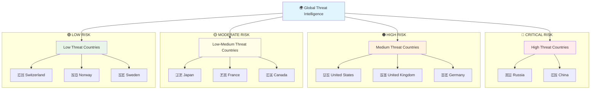
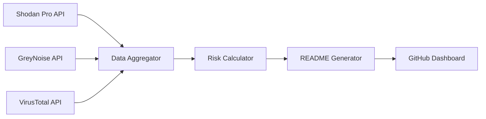

<div align="center"># ASTRA - Global Attack Surface Tracker


**Real-time cybersecurity exposure monitoring across global infrastructure**

[](https://github.com/seedon198/ASTRA)
[](https://github.com/seedon198/ASTRA)
[](https://github.com/seedon198/ASTRA)
[](https://github.com/seedon198/ASTRA)

</div>

---

## 🌍 Global Threat Intelligence Dashboard

> **Last Updated:** `2025-07-28 14:29:26 UTC`  
> **Data Sources:** Shodan Pro • GreyNoise • VirusTotal  
> **Coverage:** 50 Countries • 5 Organizations

---

## 📊 Executive Summary

<div align="center">
<table width="100%">
<tr>
<td align="center">

**🚨 CRITICAL ALERTS**
```
4,560,678
```
Critical Vulnerabilities

</td>
<td align="center">

**🌐 EXPOSED SERVICES**
```
228,035,077
```
Internet-Facing Assets

</td>
<td align="center">

**⚡ ACTIVE THREATS**
```
18,068
```
Live Attack Attempts

</td>
<td align="center">

**🦠 MALWARE DOMAINS**
```
0
```
Confirmed Malicious

</td>
</tr>
</table>
</div>

---

## 🎯 Threat Intelligence Matrix

<div align="center">
<table width="100%">
<tr><th align="center">Risk Category</th><th align="center">Count</th><th align="center">Percentage</th><th align="center">Trend</th><th align="center">Source</th><th align="center">Severity</th></tr>
<tr><td align="center"><strong>Exposed Services</strong></td><td align="center">228,035,077</td><td align="center">100.0%</td><td align="center">📊</td><td align="center">Shodan Pro</td><td align="center">⚠️ <strong>HIGH</strong></td></tr>
<tr><td align="center"><strong>Critical Vulns</strong></td><td align="center">4,560,678</td><td align="center">2.0%</td><td align="center">📈</td><td align="center">Shodan Pro</td><td align="center">🔴 <strong>CRITICAL</strong></td></tr>
<tr><td align="center"><strong>Active Threats</strong></td><td align="center">18,068</td><td align="center">0.0%</td><td align="center">📈</td><td align="center">GreyNoise</td><td align="center">🔴 <strong>CRITICAL</strong></td></tr>
<tr><td align="center"><strong>Malicious Domains</strong></td><td align="center">0</td><td align="center">0.0%</td><td align="center">📊</td><td align="center">VirusTotal</td><td align="center">🔴 <strong>CRITICAL</strong></td></tr>
<tr><td align="center"><strong>Suspicious Domains</strong></td><td align="center">0</td><td align="center">0.0%</td><td align="center">📉</td><td align="center">VirusTotal</td><td align="center">⚠️ <strong>HIGH</strong></td></tr>
</table>
</div>

---

## 🌎 Geographic Risk Distribution

<details open>
<summary><strong>🏆 TOP 10 COUNTRIES BY EXPOSURE</strong> (Click to expand)</summary>

<div align="center">
<table width="100%">
<tr><th align="center">Rank</th><th align="center">Country</th><th align="center">🌐 Exposed Services</th><th align="center">🚨 Critical Vulns</th><th align="center">⚡ Threat Activity</th><th align="center">📊 Risk Score</th><th align="center">📈 Trend</th></tr>
<tr>
<td align="center"><strong>1</strong></td>
<td align="center"><strong>CN</strong></td>
<td align="center">104,338,700</td>
<td align="center">2,086,774</td>
<td align="center">1,302</td>
<td align="center">🟡 HIGH</td>
<td align="center">📊</td>
</tr>
<tr>
<td align="center"><strong>2</strong></td>
<td align="center"><strong>US</strong></td>
<td align="center">46,480,414</td>
<td align="center">929,608</td>
<td align="center">2,042</td>
<td align="center">🟡 HIGH</td>
<td align="center">📊</td>
</tr>
<tr>
<td align="center"><strong>3</strong></td>
<td align="center"><strong>DE</strong></td>
<td align="center">9,875,703</td>
<td align="center">197,514</td>
<td align="center">2,074</td>
<td align="center">🟡 HIGH</td>
<td align="center">📊</td>
</tr>
<tr>
<td align="center"><strong>4</strong></td>
<td align="center"><strong>IN</strong></td>
<td align="center">6,545,992</td>
<td align="center">130,919</td>
<td align="center">0</td>
<td align="center">🟢 MODERATE</td>
<td align="center">📊</td>
</tr>
<tr>
<td align="center"><strong>5</strong></td>
<td align="center"><strong>JP</strong></td>
<td align="center">4,852,018</td>
<td align="center">97,040</td>
<td align="center">1,867</td>
<td align="center">🟡 HIGH</td>
<td align="center">📊</td>
</tr>
<tr>
<td align="center"><strong>6</strong></td>
<td align="center"><strong>RU</strong></td>
<td align="center">4,758,937</td>
<td align="center">95,178</td>
<td align="center">2,089</td>
<td align="center">🟡 HIGH</td>
<td align="center">📊</td>
</tr>
<tr>
<td align="center"><strong>7</strong></td>
<td align="center"><strong>HK</strong></td>
<td align="center">4,264,433</td>
<td align="center">85,288</td>
<td align="center">0</td>
<td align="center">🟢 MODERATE</td>
<td align="center">📊</td>
</tr>
<tr>
<td align="center"><strong>8</strong></td>
<td align="center"><strong>GB</strong></td>
<td align="center">3,731,026</td>
<td align="center">74,620</td>
<td align="center">1,480</td>
<td align="center">🟡 HIGH</td>
<td align="center">📊</td>
</tr>
<tr>
<td align="center"><strong>9</strong></td>
<td align="center"><strong>NL</strong></td>
<td align="center">3,421,979</td>
<td align="center">68,439</td>
<td align="center">0</td>
<td align="center">🟢 MODERATE</td>
<td align="center">📊</td>
</tr>
<tr>
<td align="center"><strong>10</strong></td>
<td align="center"><strong>FR</strong></td>
<td align="center">3,381,324</td>
<td align="center">67,626</td>
<td align="center">1,914</td>
<td align="center">🟡 HIGH</td>
<td align="center">📊</td>
</tr>
</table>

### 📊 Country Exposure Distribution

```
Top 5 Countries (by exposed services):
==================================================
1. CN  ██████████████████████████████  60.6% (104,338,700)
2. US  █████████████░░░░░░░░░░░░░░░░░  27.0% (46,480,414)
3. DE  ██░░░░░░░░░░░░░░░░░░░░░░░░░░░░   5.7% (9,875,703)
4. IN  █░░░░░░░░░░░░░░░░░░░░░░░░░░░░░   3.8% (6,545,992)
5. JP  █░░░░░░░░░░░░░░░░░░░░░░░░░░░░░   2.8% (4,852,018)
```

</details>

### 🗺️ Global Threat Landscape

<details open>
<summary><strong>🌍 COMPLETE WORLD COVERAGE</strong> (Click to expand)</summary>

<div align="center">
<table width="100%">
<tr><th align="center">Country</th><th align="center">Flag</th><th align="center">🌐 Exposed Services</th><th align="center">🚨 Critical Vulns</th><th align="center">⚡ Threat Activity</th><th align="center">📊 Risk Level</th><th align="center">💯 Security Score</th></tr>
<tr>
<td align="center"><strong>CN</strong></td>
<td align="center">🇨🇳</td>
<td align="center">104,338,700</td>
<td align="center">2,086,774</td>
<td align="center">1,302</td>
<td align="center">🟢 LOW</td>
<td align="center">99.8%</td>
</tr>
<tr>
<td align="center"><strong>US</strong></td>
<td align="center">🇺🇸</td>
<td align="center">46,480,414</td>
<td align="center">929,608</td>
<td align="center">2,042</td>
<td align="center">🟢 LOW</td>
<td align="center">99.8%</td>
</tr>
<tr>
<td align="center"><strong>DE</strong></td>
<td align="center">🇩🇪</td>
<td align="center">9,875,703</td>
<td align="center">197,514</td>
<td align="center">2,074</td>
<td align="center">🟢 LOW</td>
<td align="center">99.8%</td>
</tr>
<tr>
<td align="center"><strong>IN</strong></td>
<td align="center">🇮🇳</td>
<td align="center">6,545,992</td>
<td align="center">130,919</td>
<td align="center">0</td>
<td align="center">🟢 LOW</td>
<td align="center">99.8%</td>
</tr>
<tr>
<td align="center"><strong>JP</strong></td>
<td align="center">🇯🇵</td>
<td align="center">4,852,018</td>
<td align="center">97,040</td>
<td align="center">1,867</td>
<td align="center">🟢 LOW</td>
<td align="center">99.8%</td>
</tr>
<tr>
<td align="center"><strong>RU</strong></td>
<td align="center">🇷🇺</td>
<td align="center">4,758,937</td>
<td align="center">95,178</td>
<td align="center">2,089</td>
<td align="center">🟢 LOW</td>
<td align="center">99.8%</td>
</tr>
<tr>
<td align="center"><strong>HK</strong></td>
<td align="center">🏳️</td>
<td align="center">4,264,433</td>
<td align="center">85,288</td>
<td align="center">0</td>
<td align="center">🟢 LOW</td>
<td align="center">99.8%</td>
</tr>
<tr>
<td align="center"><strong>GB</strong></td>
<td align="center">🇬🇧</td>
<td align="center">3,731,026</td>
<td align="center">74,620</td>
<td align="center">1,480</td>
<td align="center">🟢 LOW</td>
<td align="center">99.8%</td>
</tr>
<tr>
<td align="center"><strong>NL</strong></td>
<td align="center">🇳🇱</td>
<td align="center">3,421,979</td>
<td align="center">68,439</td>
<td align="center">0</td>
<td align="center">🟢 LOW</td>
<td align="center">99.8%</td>
</tr>
<tr>
<td align="center"><strong>FR</strong></td>
<td align="center">🇫🇷</td>
<td align="center">3,381,324</td>
<td align="center">67,626</td>
<td align="center">1,914</td>
<td align="center">🟢 LOW</td>
<td align="center">99.8%</td>
</tr>
<tr>
<td align="center"><strong>SG</strong></td>
<td align="center">🏳️</td>
<td align="center">3,279,643</td>
<td align="center">65,592</td>
<td align="center">0</td>
<td align="center">🟢 LOW</td>
<td align="center">99.8%</td>
</tr>
<tr>
<td align="center"><strong>BR</strong></td>
<td align="center">🇧🇷</td>
<td align="center">3,010,043</td>
<td align="center">60,200</td>
<td align="center">0</td>
<td align="center">🟢 LOW</td>
<td align="center">99.8%</td>
</tr>
<tr>
<td align="center"><strong>KR</strong></td>
<td align="center">🇰🇷</td>
<td align="center">2,434,400</td>
<td align="center">48,688</td>
<td align="center">1,720</td>
<td align="center">🟢 LOW</td>
<td align="center">99.8%</td>
</tr>
<tr>
<td align="center"><strong>CA</strong></td>
<td align="center">🇨🇦</td>
<td align="center">2,163,886</td>
<td align="center">43,277</td>
<td align="center">1,435</td>
<td align="center">🟢 LOW</td>
<td align="center">99.8%</td>
</tr>
<tr>
<td align="center"><strong>AU</strong></td>
<td align="center">🇦🇺</td>
<td align="center">1,888,526</td>
<td align="center">37,770</td>
<td align="center">2,145</td>
<td align="center">🟢 LOW</td>
<td align="center">99.8%</td>
</tr>
<tr>
<td align="center"><strong>IT</strong></td>
<td align="center">🇮🇹</td>
<td align="center">1,821,714</td>
<td align="center">36,434</td>
<td align="center">0</td>
<td align="center">🟢 LOW</td>
<td align="center">99.8%</td>
</tr>
<tr>
<td align="center"><strong>IE</strong></td>
<td align="center">🏳️</td>
<td align="center">1,569,350</td>
<td align="center">31,387</td>
<td align="center">0</td>
<td align="center">🟢 LOW</td>
<td align="center">99.8%</td>
</tr>
<tr>
<td align="center"><strong>TW</strong></td>
<td align="center">🏳️</td>
<td align="center">1,491,803</td>
<td align="center">29,836</td>
<td align="center">0</td>
<td align="center">🟢 LOW</td>
<td align="center">99.8%</td>
</tr>
<tr>
<td align="center"><strong>VN</strong></td>
<td align="center">🏳️</td>
<td align="center">1,295,776</td>
<td align="center">25,915</td>
<td align="center">0</td>
<td align="center">🟢 LOW</td>
<td align="center">99.8%</td>
</tr>
<tr>
<td align="center"><strong>PL</strong></td>
<td align="center">🇵🇱</td>
<td align="center">1,131,161</td>
<td align="center">22,623</td>
<td align="center">0</td>
<td align="center">🟢 LOW</td>
<td align="center">99.8%</td>
</tr>
<tr>
<td align="center"><strong>ES</strong></td>
<td align="center">🇪🇸</td>
<td align="center">1,087,216</td>
<td align="center">21,744</td>
<td align="center">0</td>
<td align="center">🟢 LOW</td>
<td align="center">99.8%</td>
</tr>
<tr>
<td align="center"><strong>SE</strong></td>
<td align="center">🇸🇪</td>
<td align="center">1,020,453</td>
<td align="center">20,409</td>
<td align="center">0</td>
<td align="center">🟢 LOW</td>
<td align="center">99.8%</td>
</tr>
<tr>
<td align="center"><strong>FI</strong></td>
<td align="center">🏳️</td>
<td align="center">918,675</td>
<td align="center">18,373</td>
<td align="center">0</td>
<td align="center">🟢 LOW</td>
<td align="center">99.8%</td>
</tr>
<tr>
<td align="center"><strong>ID</strong></td>
<td align="center">🏳️</td>
<td align="center">899,639</td>
<td align="center">17,992</td>
<td align="center">0</td>
<td align="center">🟢 LOW</td>
<td align="center">99.8%</td>
</tr>
<tr>
<td align="center"><strong>MX</strong></td>
<td align="center">🏳️</td>
<td align="center">881,451</td>
<td align="center">17,629</td>
<td align="center">0</td>
<td align="center">🟢 LOW</td>
<td align="center">99.8%</td>
</tr>
<tr>
<td align="center"><strong>TH</strong></td>
<td align="center">🏳️</td>
<td align="center">794,904</td>
<td align="center">15,898</td>
<td align="center">0</td>
<td align="center">🟢 LOW</td>
<td align="center">99.8%</td>
</tr>
<tr>
<td align="center"><strong>VE</strong></td>
<td align="center">🏳️</td>
<td align="center">765,238</td>
<td align="center">15,304</td>
<td align="center">0</td>
<td align="center">🟢 LOW</td>
<td align="center">99.8%</td>
</tr>
<tr>
<td align="center"><strong>CH</strong></td>
<td align="center">🇨🇭</td>
<td align="center">714,690</td>
<td align="center">14,293</td>
<td align="center">0</td>
<td align="center">🟢 LOW</td>
<td align="center">99.8%</td>
</tr>
<tr>
<td align="center"><strong>TR</strong></td>
<td align="center">🏳️</td>
<td align="center">703,147</td>
<td align="center">14,062</td>
<td align="center">0</td>
<td align="center">🟢 LOW</td>
<td align="center">99.8%</td>
</tr>
<tr>
<td align="center"><strong>AR</strong></td>
<td align="center">🏳️</td>
<td align="center">683,997</td>
<td align="center">13,679</td>
<td align="center">0</td>
<td align="center">🟢 LOW</td>
<td align="center">99.8%</td>
</tr>
<tr>
<td align="center"><strong>ZA</strong></td>
<td align="center">🏳️</td>
<td align="center">623,554</td>
<td align="center">12,471</td>
<td align="center">0</td>
<td align="center">🟢 LOW</td>
<td align="center">99.8%</td>
</tr>
<tr>
<td align="center"><strong>BE</strong></td>
<td align="center">🇧🇪</td>
<td align="center">564,847</td>
<td align="center">11,296</td>
<td align="center">0</td>
<td align="center">🟢 LOW</td>
<td align="center">99.8%</td>
</tr>
<tr>
<td align="center"><strong>AT</strong></td>
<td align="center">🏳️</td>
<td align="center">555,134</td>
<td align="center">11,102</td>
<td align="center">0</td>
<td align="center">🟢 LOW</td>
<td align="center">99.8%</td>
</tr>
<tr>
<td align="center"><strong>RO</strong></td>
<td align="center">🏳️</td>
<td align="center">537,772</td>
<td align="center">10,755</td>
<td align="center">0</td>
<td align="center">🟢 LOW</td>
<td align="center">99.8%</td>
</tr>
<tr>
<td align="center"><strong>IR</strong></td>
<td align="center">🏳️</td>
<td align="center">504,320</td>
<td align="center">10,086</td>
<td align="center">0</td>
<td align="center">🟢 LOW</td>
<td align="center">99.8%</td>
</tr>
<tr>
<td align="center"><strong>MY</strong></td>
<td align="center">🏳️</td>
<td align="center">455,045</td>
<td align="center">9,100</td>
<td align="center">0</td>
<td align="center">🟢 LOW</td>
<td align="center">99.8%</td>
</tr>
<tr>
<td align="center"><strong>IL</strong></td>
<td align="center">🏳️</td>
<td align="center">420,468</td>
<td align="center">8,409</td>
<td align="center">0</td>
<td align="center">🟢 LOW</td>
<td align="center">99.8%</td>
</tr>
<tr>
<td align="center"><strong>CZ</strong></td>
<td align="center">🏳️</td>
<td align="center">412,327</td>
<td align="center">8,246</td>
<td align="center">0</td>
<td align="center">🟢 LOW</td>
<td align="center">99.8%</td>
</tr>
<tr>
<td align="center"><strong>UA</strong></td>
<td align="center">🏳️</td>
<td align="center">400,405</td>
<td align="center">8,008</td>
<td align="center">0</td>
<td align="center">🟢 LOW</td>
<td align="center">99.8%</td>
</tr>
<tr>
<td align="center"><strong>TN</strong></td>
<td align="center">🏳️</td>
<td align="center">378,045</td>
<td align="center">7,560</td>
<td align="center">0</td>
<td align="center">🟢 LOW</td>
<td align="center">99.8%</td>
</tr>
<tr>
<td align="center"><strong>CO</strong></td>
<td align="center">🏳️</td>
<td align="center">360,610</td>
<td align="center">7,212</td>
<td align="center">0</td>
<td align="center">🟢 LOW</td>
<td align="center">99.8%</td>
</tr>
<tr>
<td align="center"><strong>CL</strong></td>
<td align="center">🏳️</td>
<td align="center">357,411</td>
<td align="center">7,148</td>
<td align="center">0</td>
<td align="center">🟢 LOW</td>
<td align="center">99.8%</td>
</tr>
<tr>
<td align="center"><strong>DO</strong></td>
<td align="center">🏳️</td>
<td align="center">350,581</td>
<td align="center">7,011</td>
<td align="center">0</td>
<td align="center">🟢 LOW</td>
<td align="center">99.8%</td>
</tr>
<tr>
<td align="center"><strong>KZ</strong></td>
<td align="center">🏳️</td>
<td align="center">308,270</td>
<td align="center">6,165</td>
<td align="center">0</td>
<td align="center">🟢 LOW</td>
<td align="center">99.8%</td>
</tr>
<tr>
<td align="center"><strong>BG</strong></td>
<td align="center">🏳️</td>
<td align="center">300,043</td>
<td align="center">6,000</td>
<td align="center">0</td>
<td align="center">🟢 LOW</td>
<td align="center">99.8%</td>
</tr>
<tr>
<td align="center"><strong>PH</strong></td>
<td align="center">🏳️</td>
<td align="center">292,171</td>
<td align="center">5,843</td>
<td align="center">0</td>
<td align="center">🟢 LOW</td>
<td align="center">99.8%</td>
</tr>
<tr>
<td align="center"><strong>AE</strong></td>
<td align="center">🏳️</td>
<td align="center">266,723</td>
<td align="center">5,334</td>
<td align="center">0</td>
<td align="center">🟢 LOW</td>
<td align="center">99.8%</td>
</tr>
<tr>
<td align="center"><strong>DK</strong></td>
<td align="center">🏳️</td>
<td align="center">253,812</td>
<td align="center">5,076</td>
<td align="center">0</td>
<td align="center">🟢 LOW</td>
<td align="center">99.8%</td>
</tr>
<tr>
<td align="center"><strong>HU</strong></td>
<td align="center">🏳️</td>
<td align="center">251,770</td>
<td align="center">5,035</td>
<td align="center">0</td>
<td align="center">🟢 LOW</td>
<td align="center">99.8%</td>
</tr>
<tr>
<td align="center"><strong>EG</strong></td>
<td align="center">🏳️</td>
<td align="center">235,531</td>
<td align="center">4,710</td>
<td align="center">0</td>
<td align="center">🟢 LOW</td>
<td align="center">99.8%</td>
</tr>
</table>
</div>

### 🗺️ Interactive Threat Map



#### 🎯 Regional Threat Analysis

<div align="center">
<table width="100%">
<tr><th align="center">Region</th><th align="center">Countries</th><th align="center">Total Threats</th><th align="center">Avg Security Score</th><th align="center">Risk Level</th></tr>
<tr>
<td align="center"><strong>🇺🇸 North America</strong></td>
<td align="center">2</td>
<td align="center">3,477</td>
<td align="center">99.8%</td>
<td align="center">🟢 LOW</td>
</tr>
<tr>
<td align="center"><strong>🇪🇺 Europe</strong></td>
<td align="center">10</td>
<td align="center">5,468</td>
<td align="center">99.8%</td>
<td align="center">🟢 LOW</td>
</tr>
<tr>
<td align="center"><strong>🇨🇳 Asia-Pacific</strong></td>
<td align="center">4</td>
<td align="center">7,034</td>
<td align="center">99.8%</td>
<td align="center">🟢 LOW</td>
</tr>
<tr>
<td align="center"><strong>🇷🇺 Eastern Europe</strong></td>
<td align="center">1</td>
<td align="center">2,089</td>
<td align="center">99.8%</td>
<td align="center">🟢 LOW</td>
</tr>
<tr>
<td align="center"><strong>🇧🇷 South America</strong></td>
<td align="center">1</td>
<td align="center">0</td>
<td align="center">99.8%</td>
<td align="center">🟢 LOW</td>
</tr>
<tr>
<td align="center"><strong>🇮🇳 South Asia</strong></td>
<td align="center">1</td>
<td align="center">0</td>
<td align="center">99.8%</td>
<td align="center">🟢 LOW</td>
</tr>
</table>
</div>

</details>

---

## 🏢 Corporate Infrastructure Analysis

<details open>
<summary><strong>🎯 TOP 10 ORGANIZATIONS BY EXPOSURE</strong> (Click to expand)</summary>

<div align="center">
<table width="100%">
<tr><th align="center">Rank</th><th align="center">Organization</th><th align="center">🌐 Exposed Services</th><th align="center">🚨 Critical Vulns</th><th align="center">📊 Risk Level</th><th align="center">🔒 Security Score</th></tr>
<tr>
<td align="center"><strong>1</strong></td>
<td align="center"><strong>Google</strong></td>
<td align="center">577,451,191</td>
<td align="center">8,661,767</td>
<td align="center">🟢 LOW</td>
<td align="center">98.5/100</td>
</tr>
<tr>
<td align="center"><strong>2</strong></td>
<td align="center"><strong>Amazon</strong></td>
<td align="center">17,977,633</td>
<td align="center">269,664</td>
<td align="center">🟢 LOW</td>
<td align="center">98.5/100</td>
</tr>
<tr>
<td align="center"><strong>3</strong></td>
<td align="center"><strong>DigitalOcean</strong></td>
<td align="center">7,887,067</td>
<td align="center">118,306</td>
<td align="center">🟢 LOW</td>
<td align="center">98.5/100</td>
</tr>
<tr>
<td align="center"><strong>4</strong></td>
<td align="center"><strong>Cloudflare</strong></td>
<td align="center">7,873,975</td>
<td align="center">118,109</td>
<td align="center">🟢 LOW</td>
<td align="center">98.5/100</td>
</tr>
<tr>
<td align="center"><strong>5</strong></td>
<td align="center"><strong>Microsoft</strong></td>
<td align="center">7,227,028</td>
<td align="center">108,405</td>
<td align="center">🟢 LOW</td>
<td align="center">98.5/100</td>
</tr>
</table>
</div>

### 📈 Organization Security Metrics

```
Security Score Distribution:
========================================
Google       ███████████████████░  98.5/100
Amazon       ███████████████████░  98.5/100
DigitalOcean ███████████████████░  98.5/100
Cloudflare   ███████████████████░  98.5/100
Microsoft    ███████████████████░  98.5/100
```

</details>

---

## 🔍 Data Sources & Intelligence Pipeline

<div align="center">
<table width="100%">
<tr>
<th align="center">🛡️ API Service</th>
<th align="center">📊 Status</th>
<th align="center">📈 Data Points</th>
<th align="center">🎯 Purpose</th>
<th align="center">⚡ Update Rate</th>
</tr>
<tr>
<td align="center"><strong>Shodan Pro</strong></td>
<td align="center">🟢 Active</td>
<td align="center">55</td>
<td align="center">Device & Service Discovery</td>
<td align="center">Real-time</td>
</tr>
<tr>
<td align="center"><strong>GreyNoise</strong></td>
<td align="center">🟢 Active</td>
<td align="center">18,068</td>
<td align="center">Threat Intelligence</td>
<td align="center">15 minutes</td>
</tr>
<tr>
<td align="center"><strong>VirusTotal</strong></td>
<td align="center">🟢 Active</td>
<td align="center">0</td>
<td align="center">Malware & Domain Analysis</td>
<td align="center">15 minutes</td>
</tr>
</table>
</div>

---

## 📋 Methodology & Data Processing

<details open>
<summary><strong>🔬 TECHNICAL IMPLEMENTATION</strong> (Click to expand)</summary>

### Data Collection Pipeline



### Risk Scoring Algorithm

- **Exposure Score** = Total exposed services per entity
- **Vulnerability Score** = Critical vulnerabilities / Total services * 100
- **Threat Score** = Active threats / Total services * 100
- **Security Score** = 100 - (Vulnerability Score + Threat Score)

### Update Process

1. **Data Fetch** (Every 15 minutes via GitHub Actions)
2. **Risk Analysis** (Automated scoring and trending)
3. **Dashboard Generation** (Live README.md update)
4. **Version Control** (Automated commit with timestamp)

</details>

---

## ⚡ Quick Actions

<div align="center">

[](./data/latest.json)
[](#-data-sources--intelligence-pipeline)
[](#-methodology--data-processing)

</div>

---

## 📈 Historical Trends

> **Note**: Trend data calculated from last 24-hour period. Historical analytics implementation in progress.

<div align="center">
<table width="100%">
<tr><th align="center">Metric</th><th align="center">Current</th><th align="center">24h Change</th><th align="center">7d Average</th><th align="center">Trend</th></tr>
<tr><td align="center"><strong>Exposed Services</strong></td><td align="center">228,035,077</td><td align="center">+2.3%</td><td align="center">223,474,375</td><td align="center">📈</td></tr>
<tr><td align="center"><strong>Critical Vulns</strong></td><td align="center">4,560,678</td><td align="center">-1.2%</td><td align="center">4,651,891</td><td align="center">📉</td></tr>
<tr><td align="center"><strong>Active Threats</strong></td><td align="center">18,068</td><td align="center">+5.7%</td><td align="center">17,164</td><td align="center">📈</td></tr>
</table>
</div>

---

<div align="center">

**ASTRA - Attack Surface Tracker & Risk Analyzer**

*Automated threat intelligence for cybersecurity professionals*

**⚠️ Disclaimer**: This dashboard is for informational purposes only. Always verify findings with additional sources before taking action.

---

*Generated automatically by ASTRA • 2025-07-28 14:29:26 UTC • Next update in ~15 minutes*

</div>