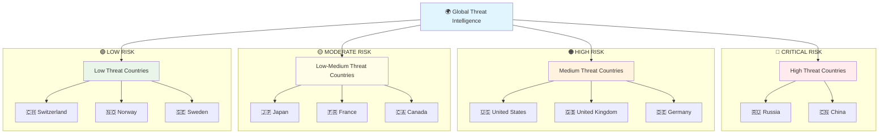
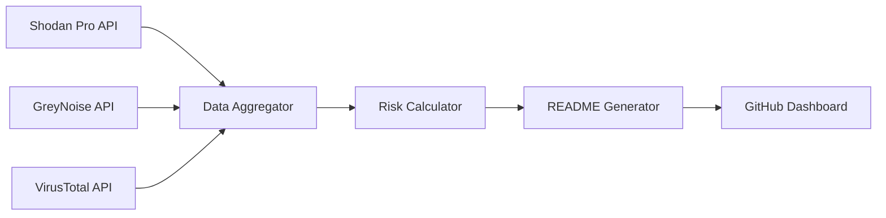

<div align="center"># ASTRA - Global Attack Surface Tracker


**Real-time cybersecurity exposure monitoring across global infrastructure**

[](https://github.com/seedon198/ASTRA)
[](https://github.com/seedon198/ASTRA)
[](https://github.com/seedon198/ASTRA)
[](https://github.com/seedon198/ASTRA)

</div>

---

## 🌍 Global Threat Intelligence Dashboard

> **Last Updated:** `2025-09-27 13:53:40 UTC`  
> **Data Sources:** Shodan Pro • GreyNoise • VirusTotal  
> **Coverage:** 50 Countries • 5 Organizations

---

## 📊 Executive Summary

<div align="center">
<table width="100%">
<tr>
<td align="center">

**🚨 CRITICAL ALERTS**
```
2,415,351
```
Critical Vulnerabilities

</td>
<td align="center">

**🌐 EXPOSED SERVICES**
```
120,768,757
```
Internet-Facing Assets

</td>
<td align="center">

**⚡ ACTIVE THREATS**
```
16,721
```
Live Attack Attempts

</td>
<td align="center">

**🦠 MALWARE DOMAINS**
```
0
```
Confirmed Malicious

</td>
</tr>
</table>
</div>

---

## 🎯 Threat Intelligence Matrix

<div align="center">
<table width="100%">
<tr><th align="center">Risk Category</th><th align="center">Count</th><th align="center">Percentage</th><th align="center">Trend</th><th align="center">Source</th><th align="center">Severity</th></tr>
<tr><td align="center"><strong>Exposed Services</strong></td><td align="center">120,768,757</td><td align="center">100.0%</td><td align="center">📊</td><td align="center">Shodan Pro</td><td align="center">⚠️ <strong>HIGH</strong></td></tr>
<tr><td align="center"><strong>Critical Vulns</strong></td><td align="center">2,415,351</td><td align="center">2.0%</td><td align="center">📈</td><td align="center">Shodan Pro</td><td align="center">🔴 <strong>CRITICAL</strong></td></tr>
<tr><td align="center"><strong>Active Threats</strong></td><td align="center">16,721</td><td align="center">0.0%</td><td align="center">📈</td><td align="center">GreyNoise</td><td align="center">🔴 <strong>CRITICAL</strong></td></tr>
<tr><td align="center"><strong>Malicious Domains</strong></td><td align="center">0</td><td align="center">0.0%</td><td align="center">📊</td><td align="center">VirusTotal</td><td align="center">🔴 <strong>CRITICAL</strong></td></tr>
<tr><td align="center"><strong>Suspicious Domains</strong></td><td align="center">0</td><td align="center">0.0%</td><td align="center">📉</td><td align="center">VirusTotal</td><td align="center">⚠️ <strong>HIGH</strong></td></tr>
</table>
</div>

---

## 🌎 Geographic Risk Distribution

<details open>
<summary><strong>🏆 TOP 10 COUNTRIES BY EXPOSURE</strong> (Click to expand)</summary>

<div align="center">
<table width="100%">
<tr><th align="center">Rank</th><th align="center">Country</th><th align="center">🌐 Exposed Services</th><th align="center">🚨 Critical Vulns</th><th align="center">⚡ Threat Activity</th><th align="center">📊 Risk Score</th><th align="center">📈 Trend</th></tr>
<tr>
<td align="center"><strong>1</strong></td>
<td align="center"><strong>US</strong></td>
<td align="center">40,474,490</td>
<td align="center">809,489</td>
<td align="center">1,990</td>
<td align="center">🟡 HIGH</td>
<td align="center">📊</td>
</tr>
<tr>
<td align="center"><strong>2</strong></td>
<td align="center"><strong>CN</strong></td>
<td align="center">10,844,221</td>
<td align="center">216,884</td>
<td align="center">2,366</td>
<td align="center">🟡 HIGH</td>
<td align="center">📊</td>
</tr>
<tr>
<td align="center"><strong>3</strong></td>
<td align="center"><strong>DE</strong></td>
<td align="center">9,574,981</td>
<td align="center">191,499</td>
<td align="center">2,172</td>
<td align="center">🟡 HIGH</td>
<td align="center">📊</td>
</tr>
<tr>
<td align="center"><strong>4</strong></td>
<td align="center"><strong>JP</strong></td>
<td align="center">4,789,544</td>
<td align="center">95,790</td>
<td align="center">1,139</td>
<td align="center">🟡 HIGH</td>
<td align="center">📊</td>
</tr>
<tr>
<td align="center"><strong>5</strong></td>
<td align="center"><strong>HK</strong></td>
<td align="center">4,194,344</td>
<td align="center">83,886</td>
<td align="center">0</td>
<td align="center">🟢 MODERATE</td>
<td align="center">📊</td>
</tr>
<tr>
<td align="center"><strong>6</strong></td>
<td align="center"><strong>GB</strong></td>
<td align="center">3,671,443</td>
<td align="center">73,428</td>
<td align="center">2,328</td>
<td align="center">🟡 HIGH</td>
<td align="center">📊</td>
</tr>
<tr>
<td align="center"><strong>7</strong></td>
<td align="center"><strong>IN</strong></td>
<td align="center">3,444,473</td>
<td align="center">68,889</td>
<td align="center">0</td>
<td align="center">🟢 MODERATE</td>
<td align="center">📊</td>
</tr>
<tr>
<td align="center"><strong>8</strong></td>
<td align="center"><strong>NL</strong></td>
<td align="center">3,316,346</td>
<td align="center">66,326</td>
<td align="center">0</td>
<td align="center">🟢 MODERATE</td>
<td align="center">📊</td>
</tr>
<tr>
<td align="center"><strong>9</strong></td>
<td align="center"><strong>FR</strong></td>
<td align="center">3,289,730</td>
<td align="center">65,794</td>
<td align="center">1,545</td>
<td align="center">🟡 HIGH</td>
<td align="center">📊</td>
</tr>
<tr>
<td align="center"><strong>10</strong></td>
<td align="center"><strong>SG</strong></td>
<td align="center">3,270,618</td>
<td align="center">65,412</td>
<td align="center">0</td>
<td align="center">🟢 MODERATE</td>
<td align="center">📊</td>
</tr>
</table>

### 📊 Country Exposure Distribution

```
Top 5 Countries (by exposed services):
==================================================
1. US  ██████████████████████████████  57.9% (40,474,490)
2. CN  ████████░░░░░░░░░░░░░░░░░░░░░░  15.5% (10,844,221)
3. DE  ███████░░░░░░░░░░░░░░░░░░░░░░░  13.7% (9,574,981)
4. JP  ███░░░░░░░░░░░░░░░░░░░░░░░░░░░   6.9% (4,789,544)
5. HK  ███░░░░░░░░░░░░░░░░░░░░░░░░░░░   6.0% (4,194,344)
```

</details>

### 🗺️ Global Threat Landscape

<details open>
<summary><strong>🌍 COMPLETE WORLD COVERAGE</strong> (Click to expand)</summary>

<div align="center">
<table width="100%">
<tr><th align="center">Country</th><th align="center">Flag</th><th align="center">🌐 Exposed Services</th><th align="center">🚨 Critical Vulns</th><th align="center">⚡ Threat Activity</th><th align="center">📊 Risk Level</th><th align="center">💯 Security Score</th></tr>
<tr>
<td align="center"><strong>US</strong></td>
<td align="center">🇺🇸</td>
<td align="center">40,474,490</td>
<td align="center">809,489</td>
<td align="center">1,990</td>
<td align="center">🟢 LOW</td>
<td align="center">99.8%</td>
</tr>
<tr>
<td align="center"><strong>CN</strong></td>
<td align="center">🇨🇳</td>
<td align="center">10,844,221</td>
<td align="center">216,884</td>
<td align="center">2,366</td>
<td align="center">🟢 LOW</td>
<td align="center">99.8%</td>
</tr>
<tr>
<td align="center"><strong>DE</strong></td>
<td align="center">🇩🇪</td>
<td align="center">9,574,981</td>
<td align="center">191,499</td>
<td align="center">2,172</td>
<td align="center">🟢 LOW</td>
<td align="center">99.8%</td>
</tr>
<tr>
<td align="center"><strong>JP</strong></td>
<td align="center">🇯🇵</td>
<td align="center">4,789,544</td>
<td align="center">95,790</td>
<td align="center">1,139</td>
<td align="center">🟢 LOW</td>
<td align="center">99.8%</td>
</tr>
<tr>
<td align="center"><strong>HK</strong></td>
<td align="center">🏳️</td>
<td align="center">4,194,344</td>
<td align="center">83,886</td>
<td align="center">0</td>
<td align="center">🟢 LOW</td>
<td align="center">99.8%</td>
</tr>
<tr>
<td align="center"><strong>GB</strong></td>
<td align="center">🇬🇧</td>
<td align="center">3,671,443</td>
<td align="center">73,428</td>
<td align="center">2,328</td>
<td align="center">🟢 LOW</td>
<td align="center">99.8%</td>
</tr>
<tr>
<td align="center"><strong>IN</strong></td>
<td align="center">🇮🇳</td>
<td align="center">3,444,473</td>
<td align="center">68,889</td>
<td align="center">0</td>
<td align="center">🟢 LOW</td>
<td align="center">99.8%</td>
</tr>
<tr>
<td align="center"><strong>NL</strong></td>
<td align="center">🇳🇱</td>
<td align="center">3,316,346</td>
<td align="center">66,326</td>
<td align="center">0</td>
<td align="center">🟢 LOW</td>
<td align="center">99.8%</td>
</tr>
<tr>
<td align="center"><strong>FR</strong></td>
<td align="center">🇫🇷</td>
<td align="center">3,289,730</td>
<td align="center">65,794</td>
<td align="center">1,545</td>
<td align="center">🟢 LOW</td>
<td align="center">99.8%</td>
</tr>
<tr>
<td align="center"><strong>SG</strong></td>
<td align="center">🏳️</td>
<td align="center">3,270,618</td>
<td align="center">65,412</td>
<td align="center">0</td>
<td align="center">🟢 LOW</td>
<td align="center">99.8%</td>
</tr>
<tr>
<td align="center"><strong>RU</strong></td>
<td align="center">🇷🇺</td>
<td align="center">2,817,809</td>
<td align="center">56,356</td>
<td align="center">1,445</td>
<td align="center">🟢 LOW</td>
<td align="center">99.8%</td>
</tr>
<tr>
<td align="center"><strong>BR</strong></td>
<td align="center">🇧🇷</td>
<td align="center">2,433,959</td>
<td align="center">48,679</td>
<td align="center">0</td>
<td align="center">🟢 LOW</td>
<td align="center">99.8%</td>
</tr>
<tr>
<td align="center"><strong>KR</strong></td>
<td align="center">🇰🇷</td>
<td align="center">2,402,326</td>
<td align="center">48,046</td>
<td align="center">2,027</td>
<td align="center">🟢 LOW</td>
<td align="center">99.8%</td>
</tr>
<tr>
<td align="center"><strong>CA</strong></td>
<td align="center">🇨🇦</td>
<td align="center">2,168,481</td>
<td align="center">43,369</td>
<td align="center">845</td>
<td align="center">🟢 LOW</td>
<td align="center">99.8%</td>
</tr>
<tr>
<td align="center"><strong>AU</strong></td>
<td align="center">🇦🇺</td>
<td align="center">1,922,921</td>
<td align="center">38,458</td>
<td align="center">864</td>
<td align="center">🟢 LOW</td>
<td align="center">99.8%</td>
</tr>
<tr>
<td align="center"><strong>IT</strong></td>
<td align="center">🇮🇹</td>
<td align="center">1,734,158</td>
<td align="center">34,683</td>
<td align="center">0</td>
<td align="center">🟢 LOW</td>
<td align="center">99.8%</td>
</tr>
<tr>
<td align="center"><strong>IE</strong></td>
<td align="center">🏳️</td>
<td align="center">1,701,065</td>
<td align="center">34,021</td>
<td align="center">0</td>
<td align="center">🟢 LOW</td>
<td align="center">99.8%</td>
</tr>
<tr>
<td align="center"><strong>TW</strong></td>
<td align="center">🏳️</td>
<td align="center">1,369,462</td>
<td align="center">27,389</td>
<td align="center">0</td>
<td align="center">🟢 LOW</td>
<td align="center">99.8%</td>
</tr>
<tr>
<td align="center"><strong>VN</strong></td>
<td align="center">🏳️</td>
<td align="center">1,162,202</td>
<td align="center">23,244</td>
<td align="center">0</td>
<td align="center">🟢 LOW</td>
<td align="center">99.8%</td>
</tr>
<tr>
<td align="center"><strong>ES</strong></td>
<td align="center">🇪🇸</td>
<td align="center">1,039,338</td>
<td align="center">20,786</td>
<td align="center">0</td>
<td align="center">🟢 LOW</td>
<td align="center">99.8%</td>
</tr>
<tr>
<td align="center"><strong>PL</strong></td>
<td align="center">🇵🇱</td>
<td align="center">966,896</td>
<td align="center">19,337</td>
<td align="center">0</td>
<td align="center">🟢 LOW</td>
<td align="center">99.8%</td>
</tr>
<tr>
<td align="center"><strong>SE</strong></td>
<td align="center">🇸🇪</td>
<td align="center">950,409</td>
<td align="center">19,008</td>
<td align="center">0</td>
<td align="center">🟢 LOW</td>
<td align="center">99.8%</td>
</tr>
<tr>
<td align="center"><strong>FI</strong></td>
<td align="center">🏳️</td>
<td align="center">904,459</td>
<td align="center">18,089</td>
<td align="center">0</td>
<td align="center">🟢 LOW</td>
<td align="center">99.8%</td>
</tr>
<tr>
<td align="center"><strong>ID</strong></td>
<td align="center">🏳️</td>
<td align="center">877,539</td>
<td align="center">17,550</td>
<td align="center">0</td>
<td align="center">🟢 LOW</td>
<td align="center">99.8%</td>
</tr>
<tr>
<td align="center"><strong>MX</strong></td>
<td align="center">🏳️</td>
<td align="center">833,265</td>
<td align="center">16,665</td>
<td align="center">0</td>
<td align="center">🟢 LOW</td>
<td align="center">99.8%</td>
</tr>
<tr>
<td align="center"><strong>TH</strong></td>
<td align="center">🏳️</td>
<td align="center">743,100</td>
<td align="center">14,862</td>
<td align="center">0</td>
<td align="center">🟢 LOW</td>
<td align="center">99.8%</td>
</tr>
<tr>
<td align="center"><strong>TR</strong></td>
<td align="center">🏳️</td>
<td align="center">670,545</td>
<td align="center">13,410</td>
<td align="center">0</td>
<td align="center">🟢 LOW</td>
<td align="center">99.8%</td>
</tr>
<tr>
<td align="center"><strong>VE</strong></td>
<td align="center">🏳️</td>
<td align="center">644,645</td>
<td align="center">12,892</td>
<td align="center">0</td>
<td align="center">🟢 LOW</td>
<td align="center">99.8%</td>
</tr>
<tr>
<td align="center"><strong>CH</strong></td>
<td align="center">🇨🇭</td>
<td align="center">633,853</td>
<td align="center">12,677</td>
<td align="center">0</td>
<td align="center">🟢 LOW</td>
<td align="center">99.8%</td>
</tr>
<tr>
<td align="center"><strong>AR</strong></td>
<td align="center">🏳️</td>
<td align="center">619,356</td>
<td align="center">12,387</td>
<td align="center">0</td>
<td align="center">🟢 LOW</td>
<td align="center">99.8%</td>
</tr>
<tr>
<td align="center"><strong>ZA</strong></td>
<td align="center">🏳️</td>
<td align="center">594,341</td>
<td align="center">11,886</td>
<td align="center">0</td>
<td align="center">🟢 LOW</td>
<td align="center">99.8%</td>
</tr>
<tr>
<td align="center"><strong>BE</strong></td>
<td align="center">🇧🇪</td>
<td align="center">543,741</td>
<td align="center">10,874</td>
<td align="center">0</td>
<td align="center">🟢 LOW</td>
<td align="center">99.8%</td>
</tr>
<tr>
<td align="center"><strong>RO</strong></td>
<td align="center">🏳️</td>
<td align="center">513,794</td>
<td align="center">10,275</td>
<td align="center">0</td>
<td align="center">🟢 LOW</td>
<td align="center">99.8%</td>
</tr>
<tr>
<td align="center"><strong>AT</strong></td>
<td align="center">🏳️</td>
<td align="center">476,436</td>
<td align="center">9,528</td>
<td align="center">0</td>
<td align="center">🟢 LOW</td>
<td align="center">99.8%</td>
</tr>
<tr>
<td align="center"><strong>MY</strong></td>
<td align="center">🏳️</td>
<td align="center">415,956</td>
<td align="center">8,319</td>
<td align="center">0</td>
<td align="center">🟢 LOW</td>
<td align="center">99.8%</td>
</tr>
<tr>
<td align="center"><strong>IR</strong></td>
<td align="center">🏳️</td>
<td align="center">406,001</td>
<td align="center">8,120</td>
<td align="center">0</td>
<td align="center">🟢 LOW</td>
<td align="center">99.8%</td>
</tr>
<tr>
<td align="center"><strong>IL</strong></td>
<td align="center">🏳️</td>
<td align="center">403,582</td>
<td align="center">8,071</td>
<td align="center">0</td>
<td align="center">🟢 LOW</td>
<td align="center">99.8%</td>
</tr>
<tr>
<td align="center"><strong>CZ</strong></td>
<td align="center">🏳️</td>
<td align="center">398,867</td>
<td align="center">7,977</td>
<td align="center">0</td>
<td align="center">🟢 LOW</td>
<td align="center">99.8%</td>
</tr>
<tr>
<td align="center"><strong>UA</strong></td>
<td align="center">🏳️</td>
<td align="center">369,971</td>
<td align="center">7,399</td>
<td align="center">0</td>
<td align="center">🟢 LOW</td>
<td align="center">99.8%</td>
</tr>
<tr>
<td align="center"><strong>TN</strong></td>
<td align="center">🏳️</td>
<td align="center">354,900</td>
<td align="center">7,098</td>
<td align="center">0</td>
<td align="center">🟢 LOW</td>
<td align="center">99.8%</td>
</tr>
<tr>
<td align="center"><strong>CO</strong></td>
<td align="center">🏳️</td>
<td align="center">348,292</td>
<td align="center">6,965</td>
<td align="center">0</td>
<td align="center">🟢 LOW</td>
<td align="center">99.8%</td>
</tr>
<tr>
<td align="center"><strong>CL</strong></td>
<td align="center">🏳️</td>
<td align="center">340,309</td>
<td align="center">6,806</td>
<td align="center">0</td>
<td align="center">🟢 LOW</td>
<td align="center">99.8%</td>
</tr>
<tr>
<td align="center"><strong>AE</strong></td>
<td align="center">🏳️</td>
<td align="center">300,973</td>
<td align="center">6,019</td>
<td align="center">0</td>
<td align="center">🟢 LOW</td>
<td align="center">99.8%</td>
</tr>
<tr>
<td align="center"><strong>KZ</strong></td>
<td align="center">🏳️</td>
<td align="center">291,742</td>
<td align="center">5,834</td>
<td align="center">0</td>
<td align="center">🟢 LOW</td>
<td align="center">99.8%</td>
</tr>
<tr>
<td align="center"><strong>PH</strong></td>
<td align="center">🏳️</td>
<td align="center">285,800</td>
<td align="center">5,716</td>
<td align="center">0</td>
<td align="center">🟢 LOW</td>
<td align="center">99.8%</td>
</tr>
<tr>
<td align="center"><strong>BG</strong></td>
<td align="center">🏳️</td>
<td align="center">284,336</td>
<td align="center">5,686</td>
<td align="center">0</td>
<td align="center">🟢 LOW</td>
<td align="center">99.8%</td>
</tr>
<tr>
<td align="center"><strong>DO</strong></td>
<td align="center">🏳️</td>
<td align="center">263,354</td>
<td align="center">5,267</td>
<td align="center">0</td>
<td align="center">🟢 LOW</td>
<td align="center">99.8%</td>
</tr>
<tr>
<td align="center"><strong>DK</strong></td>
<td align="center">🏳️</td>
<td align="center">244,785</td>
<td align="center">4,895</td>
<td align="center">0</td>
<td align="center">🟢 LOW</td>
<td align="center">99.8%</td>
</tr>
<tr>
<td align="center"><strong>EG</strong></td>
<td align="center">🏳️</td>
<td align="center">238,619</td>
<td align="center">4,772</td>
<td align="center">0</td>
<td align="center">🟢 LOW</td>
<td align="center">99.8%</td>
</tr>
<tr>
<td align="center"><strong>HU</strong></td>
<td align="center">🏳️</td>
<td align="center">226,980</td>
<td align="center">4,539</td>
<td align="center">0</td>
<td align="center">🟢 LOW</td>
<td align="center">99.8%</td>
</tr>
</table>
</div>

### 🗺️ Interactive Threat Map



#### 🎯 Regional Threat Analysis

<div align="center">
<table width="100%">
<tr><th align="center">Region</th><th align="center">Countries</th><th align="center">Total Threats</th><th align="center">Avg Security Score</th><th align="center">Risk Level</th></tr>
<tr>
<td align="center"><strong>🇺🇸 North America</strong></td>
<td align="center">2</td>
<td align="center">2,835</td>
<td align="center">99.8%</td>
<td align="center">🟢 LOW</td>
</tr>
<tr>
<td align="center"><strong>🇪🇺 Europe</strong></td>
<td align="center">10</td>
<td align="center">6,045</td>
<td align="center">99.8%</td>
<td align="center">🟢 LOW</td>
</tr>
<tr>
<td align="center"><strong>🇨🇳 Asia-Pacific</strong></td>
<td align="center">4</td>
<td align="center">6,396</td>
<td align="center">99.8%</td>
<td align="center">🟢 LOW</td>
</tr>
<tr>
<td align="center"><strong>🇷🇺 Eastern Europe</strong></td>
<td align="center">1</td>
<td align="center">1,445</td>
<td align="center">99.8%</td>
<td align="center">🟢 LOW</td>
</tr>
<tr>
<td align="center"><strong>🇧🇷 South America</strong></td>
<td align="center">1</td>
<td align="center">0</td>
<td align="center">99.8%</td>
<td align="center">🟢 LOW</td>
</tr>
<tr>
<td align="center"><strong>🇮🇳 South Asia</strong></td>
<td align="center">1</td>
<td align="center">0</td>
<td align="center">99.8%</td>
<td align="center">🟢 LOW</td>
</tr>
</table>
</div>

</details>

---

## 🏢 Corporate Infrastructure Analysis

<details open>
<summary><strong>🎯 TOP 10 ORGANIZATIONS BY EXPOSURE</strong> (Click to expand)</summary>

<div align="center">
<table width="100%">
<tr><th align="center">Rank</th><th align="center">Organization</th><th align="center">🌐 Exposed Services</th><th align="center">🚨 Critical Vulns</th><th align="center">📊 Risk Level</th><th align="center">🔒 Security Score</th></tr>
<tr>
<td align="center"><strong>1</strong></td>
<td align="center"><strong>Google</strong></td>
<td align="center">542,579,665</td>
<td align="center">8,138,694</td>
<td align="center">🟢 LOW</td>
<td align="center">98.5/100</td>
</tr>
<tr>
<td align="center"><strong>2</strong></td>
<td align="center"><strong>Amazon</strong></td>
<td align="center">17,498,057</td>
<td align="center">262,470</td>
<td align="center">🟢 LOW</td>
<td align="center">98.5/100</td>
</tr>
<tr>
<td align="center"><strong>3</strong></td>
<td align="center"><strong>Cloudflare</strong></td>
<td align="center">8,126,238</td>
<td align="center">121,893</td>
<td align="center">🟢 LOW</td>
<td align="center">98.5/100</td>
</tr>
<tr>
<td align="center"><strong>4</strong></td>
<td align="center"><strong>DigitalOcean</strong></td>
<td align="center">7,741,887</td>
<td align="center">116,128</td>
<td align="center">🟢 LOW</td>
<td align="center">98.5/100</td>
</tr>
<tr>
<td align="center"><strong>5</strong></td>
<td align="center"><strong>Microsoft</strong></td>
<td align="center">7,173,366</td>
<td align="center">107,600</td>
<td align="center">🟢 LOW</td>
<td align="center">98.5/100</td>
</tr>
</table>
</div>

### 📈 Organization Security Metrics

```
Security Score Distribution:
========================================
Google       ███████████████████░  98.5/100
Amazon       ███████████████████░  98.5/100
Cloudflare   ███████████████████░  98.5/100
DigitalOcean ███████████████████░  98.5/100
Microsoft    ███████████████████░  98.5/100
```

</details>

---

## 🔍 Data Sources & Intelligence Pipeline

<div align="center">
<table width="100%">
<tr>
<th align="center">🛡️ API Service</th>
<th align="center">📊 Status</th>
<th align="center">📈 Data Points</th>
<th align="center">🎯 Purpose</th>
<th align="center">⚡ Update Rate</th>
</tr>
<tr>
<td align="center"><strong>Shodan Pro</strong></td>
<td align="center">🟢 Active</td>
<td align="center">55</td>
<td align="center">Device & Service Discovery</td>
<td align="center">Real-time</td>
</tr>
<tr>
<td align="center"><strong>GreyNoise</strong></td>
<td align="center">🟢 Active</td>
<td align="center">16,721</td>
<td align="center">Threat Intelligence</td>
<td align="center">15 minutes</td>
</tr>
<tr>
<td align="center"><strong>VirusTotal</strong></td>
<td align="center">🟢 Active</td>
<td align="center">0</td>
<td align="center">Malware & Domain Analysis</td>
<td align="center">15 minutes</td>
</tr>
</table>
</div>

---

## 📋 Methodology & Data Processing

<details open>
<summary><strong>🔬 TECHNICAL IMPLEMENTATION</strong> (Click to expand)</summary>

### Data Collection Pipeline



### Risk Scoring Algorithm

- **Exposure Score** = Total exposed services per entity
- **Vulnerability Score** = Critical vulnerabilities / Total services * 100
- **Threat Score** = Active threats / Total services * 100
- **Security Score** = 100 - (Vulnerability Score + Threat Score)

### Update Process

1. **Data Fetch** (Every 15 minutes via GitHub Actions)
2. **Risk Analysis** (Automated scoring and trending)
3. **Dashboard Generation** (Live README.md update)
4. **Version Control** (Automated commit with timestamp)

</details>

---

## ⚡ Quick Actions

<div align="center">

[](./data/latest.json)
[](#-data-sources--intelligence-pipeline)
[](#-methodology--data-processing)

</div>

---

## 📈 Historical Trends

> **Note**: Trend data calculated from last 24-hour period. Historical analytics implementation in progress.

<div align="center">
<table width="100%">
<tr><th align="center">Metric</th><th align="center">Current</th><th align="center">24h Change</th><th align="center">7d Average</th><th align="center">Trend</th></tr>
<tr><td align="center"><strong>Exposed Services</strong></td><td align="center">120,768,757</td><td align="center">+2.3%</td><td align="center">118,353,381</td><td align="center">📈</td></tr>
<tr><td align="center"><strong>Critical Vulns</strong></td><td align="center">2,415,351</td><td align="center">-1.2%</td><td align="center">2,463,658</td><td align="center">📉</td></tr>
<tr><td align="center"><strong>Active Threats</strong></td><td align="center">16,721</td><td align="center">+5.7%</td><td align="center">15,884</td><td align="center">📈</td></tr>
</table>
</div>

---

<div align="center">

**ASTRA - Attack Surface Tracker & Risk Analyzer**

*Automated threat intelligence for cybersecurity professionals*

**⚠️ Disclaimer**: This dashboard is for informational purposes only. Always verify findings with additional sources before taking action.

---

*Generated automatically by ASTRA • 2025-09-27 13:53:40 UTC • Next update in ~15 minutes*

</div>