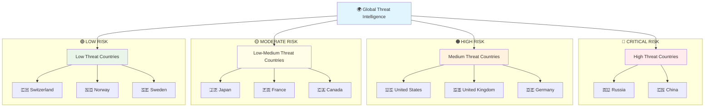
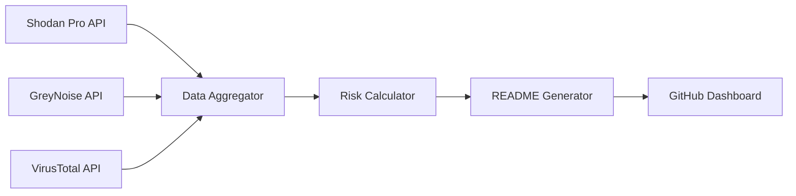

<div align="center"># ASTRA - Global Attack Surface Tracker


**Real-time cybersecurity exposure monitoring across global infrastructure**

[](https://github.com/seedon198/ASTRA)
[](https://github.com/seedon198/ASTRA)
[](https://github.com/seedon198/ASTRA)
[](https://github.com/seedon198/ASTRA)

</div>

---

## 🌍 Global Threat Intelligence Dashboard

> **Last Updated:** `2025-11-12 04:55:33 UTC`  
> **Data Sources:** Shodan Pro • GreyNoise • VirusTotal  
> **Coverage:** 50 Countries • 5 Organizations

---

## 📊 Executive Summary

<div align="center">
<table width="100%">
<tr>
<td align="center">

**🚨 CRITICAL ALERTS**
```
2,491,088
```
Critical Vulnerabilities

</td>
<td align="center">

**🌐 EXPOSED SERVICES**
```
124,555,550
```
Internet-Facing Assets

</td>
<td align="center">

**⚡ ACTIVE THREATS**
```
17,378
```
Live Attack Attempts

</td>
<td align="center">

**🦠 MALWARE DOMAINS**
```
0
```
Confirmed Malicious

</td>
</tr>
</table>
</div>

---

## 🎯 Threat Intelligence Matrix

<div align="center">
<table width="100%">
<tr><th align="center">Risk Category</th><th align="center">Count</th><th align="center">Percentage</th><th align="center">Trend</th><th align="center">Source</th><th align="center">Severity</th></tr>
<tr><td align="center"><strong>Exposed Services</strong></td><td align="center">124,555,550</td><td align="center">100.0%</td><td align="center">📊</td><td align="center">Shodan Pro</td><td align="center">⚠️ <strong>HIGH</strong></td></tr>
<tr><td align="center"><strong>Critical Vulns</strong></td><td align="center">2,491,088</td><td align="center">2.0%</td><td align="center">📈</td><td align="center">Shodan Pro</td><td align="center">🔴 <strong>CRITICAL</strong></td></tr>
<tr><td align="center"><strong>Active Threats</strong></td><td align="center">17,378</td><td align="center">0.0%</td><td align="center">📈</td><td align="center">GreyNoise</td><td align="center">🔴 <strong>CRITICAL</strong></td></tr>
<tr><td align="center"><strong>Malicious Domains</strong></td><td align="center">0</td><td align="center">0.0%</td><td align="center">📊</td><td align="center">VirusTotal</td><td align="center">🔴 <strong>CRITICAL</strong></td></tr>
<tr><td align="center"><strong>Suspicious Domains</strong></td><td align="center">0</td><td align="center">0.0%</td><td align="center">📉</td><td align="center">VirusTotal</td><td align="center">⚠️ <strong>HIGH</strong></td></tr>
</table>
</div>

---

## 🌎 Geographic Risk Distribution

<details open>
<summary><strong>🏆 TOP 10 COUNTRIES BY EXPOSURE</strong> (Click to expand)</summary>

<div align="center">
<table width="100%">
<tr><th align="center">Rank</th><th align="center">Country</th><th align="center">🌐 Exposed Services</th><th align="center">🚨 Critical Vulns</th><th align="center">⚡ Threat Activity</th><th align="center">📊 Risk Score</th><th align="center">📈 Trend</th></tr>
<tr>
<td align="center"><strong>1</strong></td>
<td align="center"><strong>US</strong></td>
<td align="center">42,948,072</td>
<td align="center">858,961</td>
<td align="center">858</td>
<td align="center">🟡 HIGH</td>
<td align="center">📊</td>
</tr>
<tr>
<td align="center"><strong>2</strong></td>
<td align="center"><strong>DE</strong></td>
<td align="center">9,946,046</td>
<td align="center">198,920</td>
<td align="center">1,589</td>
<td align="center">🟡 HIGH</td>
<td align="center">📊</td>
</tr>
<tr>
<td align="center"><strong>3</strong></td>
<td align="center"><strong>CN</strong></td>
<td align="center">9,766,878</td>
<td align="center">195,337</td>
<td align="center">2,209</td>
<td align="center">🟡 HIGH</td>
<td align="center">📊</td>
</tr>
<tr>
<td align="center"><strong>4</strong></td>
<td align="center"><strong>JP</strong></td>
<td align="center">5,110,292</td>
<td align="center">102,205</td>
<td align="center">2,332</td>
<td align="center">🟡 HIGH</td>
<td align="center">📊</td>
</tr>
<tr>
<td align="center"><strong>5</strong></td>
<td align="center"><strong>HK</strong></td>
<td align="center">4,293,112</td>
<td align="center">85,862</td>
<td align="center">0</td>
<td align="center">🟢 MODERATE</td>
<td align="center">📊</td>
</tr>
<tr>
<td align="center"><strong>6</strong></td>
<td align="center"><strong>GB</strong></td>
<td align="center">3,875,434</td>
<td align="center">77,508</td>
<td align="center">2,030</td>
<td align="center">🟡 HIGH</td>
<td align="center">📊</td>
</tr>
<tr>
<td align="center"><strong>7</strong></td>
<td align="center"><strong>IN</strong></td>
<td align="center">3,559,287</td>
<td align="center">71,185</td>
<td align="center">0</td>
<td align="center">🟢 MODERATE</td>
<td align="center">📊</td>
</tr>
<tr>
<td align="center"><strong>8</strong></td>
<td align="center"><strong>FR</strong></td>
<td align="center">3,390,092</td>
<td align="center">67,801</td>
<td align="center">1,946</td>
<td align="center">🟡 HIGH</td>
<td align="center">📊</td>
</tr>
<tr>
<td align="center"><strong>9</strong></td>
<td align="center"><strong>SG</strong></td>
<td align="center">3,384,634</td>
<td align="center">67,692</td>
<td align="center">0</td>
<td align="center">🟢 MODERATE</td>
<td align="center">📊</td>
</tr>
<tr>
<td align="center"><strong>10</strong></td>
<td align="center"><strong>NL</strong></td>
<td align="center">3,365,685</td>
<td align="center">67,313</td>
<td align="center">0</td>
<td align="center">🟢 MODERATE</td>
<td align="center">📊</td>
</tr>
</table>

### 📊 Country Exposure Distribution

```
Top 5 Countries (by exposed services):
==================================================
1. US  ██████████████████████████████  59.6% (42,948,072)
2. DE  ██████░░░░░░░░░░░░░░░░░░░░░░░░  13.8% (9,946,046)
3. CN  ██████░░░░░░░░░░░░░░░░░░░░░░░░  13.6% (9,766,878)
4. JP  ███░░░░░░░░░░░░░░░░░░░░░░░░░░░   7.1% (5,110,292)
5. HK  ██░░░░░░░░░░░░░░░░░░░░░░░░░░░░   6.0% (4,293,112)
```

</details>

### 🗺️ Global Threat Landscape

<details open>
<summary><strong>🌍 COMPLETE WORLD COVERAGE</strong> (Click to expand)</summary>

<div align="center">
<table width="100%">
<tr><th align="center">Country</th><th align="center">Flag</th><th align="center">🌐 Exposed Services</th><th align="center">🚨 Critical Vulns</th><th align="center">⚡ Threat Activity</th><th align="center">📊 Risk Level</th><th align="center">💯 Security Score</th></tr>
<tr>
<td align="center"><strong>US</strong></td>
<td align="center">🇺🇸</td>
<td align="center">42,948,072</td>
<td align="center">858,961</td>
<td align="center">858</td>
<td align="center">🟢 LOW</td>
<td align="center">99.8%</td>
</tr>
<tr>
<td align="center"><strong>DE</strong></td>
<td align="center">🇩🇪</td>
<td align="center">9,946,046</td>
<td align="center">198,920</td>
<td align="center">1,589</td>
<td align="center">🟢 LOW</td>
<td align="center">99.8%</td>
</tr>
<tr>
<td align="center"><strong>CN</strong></td>
<td align="center">🇨🇳</td>
<td align="center">9,766,878</td>
<td align="center">195,337</td>
<td align="center">2,209</td>
<td align="center">🟢 LOW</td>
<td align="center">99.8%</td>
</tr>
<tr>
<td align="center"><strong>JP</strong></td>
<td align="center">🇯🇵</td>
<td align="center">5,110,292</td>
<td align="center">102,205</td>
<td align="center">2,332</td>
<td align="center">🟢 LOW</td>
<td align="center">99.8%</td>
</tr>
<tr>
<td align="center"><strong>HK</strong></td>
<td align="center">🏳️</td>
<td align="center">4,293,112</td>
<td align="center">85,862</td>
<td align="center">0</td>
<td align="center">🟢 LOW</td>
<td align="center">99.8%</td>
</tr>
<tr>
<td align="center"><strong>GB</strong></td>
<td align="center">🇬🇧</td>
<td align="center">3,875,434</td>
<td align="center">77,508</td>
<td align="center">2,030</td>
<td align="center">🟢 LOW</td>
<td align="center">99.8%</td>
</tr>
<tr>
<td align="center"><strong>IN</strong></td>
<td align="center">🇮🇳</td>
<td align="center">3,559,287</td>
<td align="center">71,185</td>
<td align="center">0</td>
<td align="center">🟢 LOW</td>
<td align="center">99.8%</td>
</tr>
<tr>
<td align="center"><strong>FR</strong></td>
<td align="center">🇫🇷</td>
<td align="center">3,390,092</td>
<td align="center">67,801</td>
<td align="center">1,946</td>
<td align="center">🟢 LOW</td>
<td align="center">99.8%</td>
</tr>
<tr>
<td align="center"><strong>SG</strong></td>
<td align="center">🏳️</td>
<td align="center">3,384,634</td>
<td align="center">67,692</td>
<td align="center">0</td>
<td align="center">🟢 LOW</td>
<td align="center">99.8%</td>
</tr>
<tr>
<td align="center"><strong>NL</strong></td>
<td align="center">🇳🇱</td>
<td align="center">3,365,685</td>
<td align="center">67,313</td>
<td align="center">0</td>
<td align="center">🟢 LOW</td>
<td align="center">99.8%</td>
</tr>
<tr>
<td align="center"><strong>RU</strong></td>
<td align="center">🇷🇺</td>
<td align="center">2,749,900</td>
<td align="center">54,998</td>
<td align="center">1,908</td>
<td align="center">🟢 LOW</td>
<td align="center">99.8%</td>
</tr>
<tr>
<td align="center"><strong>BR</strong></td>
<td align="center">🇧🇷</td>
<td align="center">2,554,515</td>
<td align="center">51,090</td>
<td align="center">0</td>
<td align="center">🟢 LOW</td>
<td align="center">99.8%</td>
</tr>
<tr>
<td align="center"><strong>KR</strong></td>
<td align="center">🇰🇷</td>
<td align="center">2,530,357</td>
<td align="center">50,607</td>
<td align="center">1,203</td>
<td align="center">🟢 LOW</td>
<td align="center">99.8%</td>
</tr>
<tr>
<td align="center"><strong>CA</strong></td>
<td align="center">🇨🇦</td>
<td align="center">2,231,879</td>
<td align="center">44,637</td>
<td align="center">1,597</td>
<td align="center">🟢 LOW</td>
<td align="center">99.8%</td>
</tr>
<tr>
<td align="center"><strong>AU</strong></td>
<td align="center">🇦🇺</td>
<td align="center">2,062,880</td>
<td align="center">41,257</td>
<td align="center">1,706</td>
<td align="center">🟢 LOW</td>
<td align="center">99.8%</td>
</tr>
<tr>
<td align="center"><strong>IE</strong></td>
<td align="center">🏳️</td>
<td align="center">1,967,371</td>
<td align="center">39,347</td>
<td align="center">0</td>
<td align="center">🟢 LOW</td>
<td align="center">99.8%</td>
</tr>
<tr>
<td align="center"><strong>IT</strong></td>
<td align="center">🇮🇹</td>
<td align="center">1,772,459</td>
<td align="center">35,449</td>
<td align="center">0</td>
<td align="center">🟢 LOW</td>
<td align="center">99.8%</td>
</tr>
<tr>
<td align="center"><strong>TW</strong></td>
<td align="center">🏳️</td>
<td align="center">1,387,692</td>
<td align="center">27,753</td>
<td align="center">0</td>
<td align="center">🟢 LOW</td>
<td align="center">99.8%</td>
</tr>
<tr>
<td align="center"><strong>VN</strong></td>
<td align="center">🏳️</td>
<td align="center">1,213,462</td>
<td align="center">24,269</td>
<td align="center">0</td>
<td align="center">🟢 LOW</td>
<td align="center">99.8%</td>
</tr>
<tr>
<td align="center"><strong>ES</strong></td>
<td align="center">🇪🇸</td>
<td align="center">1,079,785</td>
<td align="center">21,595</td>
<td align="center">0</td>
<td align="center">🟢 LOW</td>
<td align="center">99.8%</td>
</tr>
<tr>
<td align="center"><strong>SE</strong></td>
<td align="center">🇸🇪</td>
<td align="center">1,018,855</td>
<td align="center">20,377</td>
<td align="center">0</td>
<td align="center">🟢 LOW</td>
<td align="center">99.8%</td>
</tr>
<tr>
<td align="center"><strong>PL</strong></td>
<td align="center">🇵🇱</td>
<td align="center">1,009,836</td>
<td align="center">20,196</td>
<td align="center">0</td>
<td align="center">🟢 LOW</td>
<td align="center">99.8%</td>
</tr>
<tr>
<td align="center"><strong>FI</strong></td>
<td align="center">🏳️</td>
<td align="center">929,743</td>
<td align="center">18,594</td>
<td align="center">0</td>
<td align="center">🟢 LOW</td>
<td align="center">99.8%</td>
</tr>
<tr>
<td align="center"><strong>ID</strong></td>
<td align="center">🏳️</td>
<td align="center">894,924</td>
<td align="center">17,898</td>
<td align="center">0</td>
<td align="center">🟢 LOW</td>
<td align="center">99.8%</td>
</tr>
<tr>
<td align="center"><strong>MX</strong></td>
<td align="center">🏳️</td>
<td align="center">862,117</td>
<td align="center">17,242</td>
<td align="center">0</td>
<td align="center">🟢 LOW</td>
<td align="center">99.8%</td>
</tr>
<tr>
<td align="center"><strong>TH</strong></td>
<td align="center">🏳️</td>
<td align="center">761,840</td>
<td align="center">15,236</td>
<td align="center">0</td>
<td align="center">🟢 LOW</td>
<td align="center">99.8%</td>
</tr>
<tr>
<td align="center"><strong>TR</strong></td>
<td align="center">🏳️</td>
<td align="center">690,112</td>
<td align="center">13,802</td>
<td align="center">0</td>
<td align="center">🟢 LOW</td>
<td align="center">99.8%</td>
</tr>
<tr>
<td align="center"><strong>VE</strong></td>
<td align="center">🏳️</td>
<td align="center">634,747</td>
<td align="center">12,694</td>
<td align="center">0</td>
<td align="center">🟢 LOW</td>
<td align="center">99.8%</td>
</tr>
<tr>
<td align="center"><strong>CH</strong></td>
<td align="center">🇨🇭</td>
<td align="center">630,565</td>
<td align="center">12,611</td>
<td align="center">0</td>
<td align="center">🟢 LOW</td>
<td align="center">99.8%</td>
</tr>
<tr>
<td align="center"><strong>ZA</strong></td>
<td align="center">🏳️</td>
<td align="center">622,766</td>
<td align="center">12,455</td>
<td align="center">0</td>
<td align="center">🟢 LOW</td>
<td align="center">99.8%</td>
</tr>
<tr>
<td align="center"><strong>AR</strong></td>
<td align="center">🏳️</td>
<td align="center">620,945</td>
<td align="center">12,418</td>
<td align="center">0</td>
<td align="center">🟢 LOW</td>
<td align="center">99.8%</td>
</tr>
<tr>
<td align="center"><strong>BE</strong></td>
<td align="center">🇧🇪</td>
<td align="center">545,217</td>
<td align="center">10,904</td>
<td align="center">0</td>
<td align="center">🟢 LOW</td>
<td align="center">99.8%</td>
</tr>
<tr>
<td align="center"><strong>RO</strong></td>
<td align="center">🏳️</td>
<td align="center">526,741</td>
<td align="center">10,534</td>
<td align="center">0</td>
<td align="center">🟢 LOW</td>
<td align="center">99.8%</td>
</tr>
<tr>
<td align="center"><strong>AT</strong></td>
<td align="center">🏳️</td>
<td align="center">474,730</td>
<td align="center">9,494</td>
<td align="center">0</td>
<td align="center">🟢 LOW</td>
<td align="center">99.8%</td>
</tr>
<tr>
<td align="center"><strong>MY</strong></td>
<td align="center">🏳️</td>
<td align="center">433,951</td>
<td align="center">8,679</td>
<td align="center">0</td>
<td align="center">🟢 LOW</td>
<td align="center">99.8%</td>
</tr>
<tr>
<td align="center"><strong>IL</strong></td>
<td align="center">🏳️</td>
<td align="center">415,060</td>
<td align="center">8,301</td>
<td align="center">0</td>
<td align="center">🟢 LOW</td>
<td align="center">99.8%</td>
</tr>
<tr>
<td align="center"><strong>UA</strong></td>
<td align="center">🏳️</td>
<td align="center">411,212</td>
<td align="center">8,224</td>
<td align="center">0</td>
<td align="center">🟢 LOW</td>
<td align="center">99.8%</td>
</tr>
<tr>
<td align="center"><strong>CZ</strong></td>
<td align="center">🏳️</td>
<td align="center">403,202</td>
<td align="center">8,064</td>
<td align="center">0</td>
<td align="center">🟢 LOW</td>
<td align="center">99.8%</td>
</tr>
<tr>
<td align="center"><strong>AE</strong></td>
<td align="center">🏳️</td>
<td align="center">362,841</td>
<td align="center">7,256</td>
<td align="center">0</td>
<td align="center">🟢 LOW</td>
<td align="center">99.8%</td>
</tr>
<tr>
<td align="center"><strong>TN</strong></td>
<td align="center">🏳️</td>
<td align="center">359,950</td>
<td align="center">7,199</td>
<td align="center">0</td>
<td align="center">🟢 LOW</td>
<td align="center">99.8%</td>
</tr>
<tr>
<td align="center"><strong>CL</strong></td>
<td align="center">🏳️</td>
<td align="center">345,713</td>
<td align="center">6,914</td>
<td align="center">0</td>
<td align="center">🟢 LOW</td>
<td align="center">99.8%</td>
</tr>
<tr>
<td align="center"><strong>CO</strong></td>
<td align="center">🏳️</td>
<td align="center">336,602</td>
<td align="center">6,732</td>
<td align="center">0</td>
<td align="center">🟢 LOW</td>
<td align="center">99.8%</td>
</tr>
<tr>
<td align="center"><strong>BG</strong></td>
<td align="center">🏳️</td>
<td align="center">291,751</td>
<td align="center">5,835</td>
<td align="center">0</td>
<td align="center">🟢 LOW</td>
<td align="center">99.8%</td>
</tr>
<tr>
<td align="center"><strong>KZ</strong></td>
<td align="center">🏳️</td>
<td align="center">291,678</td>
<td align="center">5,833</td>
<td align="center">0</td>
<td align="center">🟢 LOW</td>
<td align="center">99.8%</td>
</tr>
<tr>
<td align="center"><strong>PH</strong></td>
<td align="center">🏳️</td>
<td align="center">286,285</td>
<td align="center">5,725</td>
<td align="center">0</td>
<td align="center">🟢 LOW</td>
<td align="center">99.8%</td>
</tr>
<tr>
<td align="center"><strong>EG</strong></td>
<td align="center">🏳️</td>
<td align="center">265,865</td>
<td align="center">5,317</td>
<td align="center">0</td>
<td align="center">🟢 LOW</td>
<td align="center">99.8%</td>
</tr>
<tr>
<td align="center"><strong>DK</strong></td>
<td align="center">🏳️</td>
<td align="center">250,469</td>
<td align="center">5,009</td>
<td align="center">0</td>
<td align="center">🟢 LOW</td>
<td align="center">99.8%</td>
</tr>
<tr>
<td align="center"><strong>HU</strong></td>
<td align="center">🏳️</td>
<td align="center">237,318</td>
<td align="center">4,746</td>
<td align="center">0</td>
<td align="center">🟢 LOW</td>
<td align="center">99.8%</td>
</tr>
<tr>
<td align="center"><strong>SA</strong></td>
<td align="center">🏳️</td>
<td align="center">225,780</td>
<td align="center">4,515</td>
<td align="center">0</td>
<td align="center">🟢 LOW</td>
<td align="center">99.8%</td>
</tr>
<tr>
<td align="center"><strong>IR</strong></td>
<td align="center">🏳️</td>
<td align="center">224,903</td>
<td align="center">4,498</td>
<td align="center">0</td>
<td align="center">🟢 LOW</td>
<td align="center">99.8%</td>
</tr>
</table>
</div>

### 🗺️ Interactive Threat Map



#### 🎯 Regional Threat Analysis

<div align="center">
<table width="100%">
<tr><th align="center">Region</th><th align="center">Countries</th><th align="center">Total Threats</th><th align="center">Avg Security Score</th><th align="center">Risk Level</th></tr>
<tr>
<td align="center"><strong>🇺🇸 North America</strong></td>
<td align="center">2</td>
<td align="center">2,455</td>
<td align="center">99.8%</td>
<td align="center">🟢 LOW</td>
</tr>
<tr>
<td align="center"><strong>🇪🇺 Europe</strong></td>
<td align="center">10</td>
<td align="center">5,565</td>
<td align="center">99.8%</td>
<td align="center">🟢 LOW</td>
</tr>
<tr>
<td align="center"><strong>🇨🇳 Asia-Pacific</strong></td>
<td align="center">4</td>
<td align="center">7,450</td>
<td align="center">99.8%</td>
<td align="center">🟢 LOW</td>
</tr>
<tr>
<td align="center"><strong>🇷🇺 Eastern Europe</strong></td>
<td align="center">1</td>
<td align="center">1,908</td>
<td align="center">99.8%</td>
<td align="center">🟢 LOW</td>
</tr>
<tr>
<td align="center"><strong>🇧🇷 South America</strong></td>
<td align="center">1</td>
<td align="center">0</td>
<td align="center">99.8%</td>
<td align="center">🟢 LOW</td>
</tr>
<tr>
<td align="center"><strong>🇮🇳 South Asia</strong></td>
<td align="center">1</td>
<td align="center">0</td>
<td align="center">99.8%</td>
<td align="center">🟢 LOW</td>
</tr>
</table>
</div>

</details>

---

## 🏢 Corporate Infrastructure Analysis

<details open>
<summary><strong>🎯 TOP 10 ORGANIZATIONS BY EXPOSURE</strong> (Click to expand)</summary>

<div align="center">
<table width="100%">
<tr><th align="center">Rank</th><th align="center">Organization</th><th align="center">🌐 Exposed Services</th><th align="center">🚨 Critical Vulns</th><th align="center">📊 Risk Level</th><th align="center">🔒 Security Score</th></tr>
<tr>
<td align="center"><strong>1</strong></td>
<td align="center"><strong>Google</strong></td>
<td align="center">550,538,931</td>
<td align="center">8,258,083</td>
<td align="center">🟢 LOW</td>
<td align="center">98.5/100</td>
</tr>
<tr>
<td align="center"><strong>2</strong></td>
<td align="center"><strong>Amazon</strong></td>
<td align="center">20,133,736</td>
<td align="center">302,006</td>
<td align="center">🟢 LOW</td>
<td align="center">98.5/100</td>
</tr>
<tr>
<td align="center"><strong>3</strong></td>
<td align="center"><strong>Cloudflare</strong></td>
<td align="center">8,343,646</td>
<td align="center">125,154</td>
<td align="center">🟢 LOW</td>
<td align="center">98.5/100</td>
</tr>
<tr>
<td align="center"><strong>4</strong></td>
<td align="center"><strong>DigitalOcean</strong></td>
<td align="center">7,784,590</td>
<td align="center">116,768</td>
<td align="center">🟢 LOW</td>
<td align="center">98.5/100</td>
</tr>
<tr>
<td align="center"><strong>5</strong></td>
<td align="center"><strong>Microsoft</strong></td>
<td align="center">7,549,069</td>
<td align="center">113,236</td>
<td align="center">🟢 LOW</td>
<td align="center">98.5/100</td>
</tr>
</table>
</div>

### 📈 Organization Security Metrics

```
Security Score Distribution:
========================================
Google       ███████████████████░  98.5/100
Amazon       ███████████████████░  98.5/100
Cloudflare   ███████████████████░  98.5/100
DigitalOcean ███████████████████░  98.5/100
Microsoft    ███████████████████░  98.5/100
```

</details>

---

## 🔍 Data Sources & Intelligence Pipeline

<div align="center">
<table width="100%">
<tr>
<th align="center">🛡️ API Service</th>
<th align="center">📊 Status</th>
<th align="center">📈 Data Points</th>
<th align="center">🎯 Purpose</th>
<th align="center">⚡ Update Rate</th>
</tr>
<tr>
<td align="center"><strong>Shodan Pro</strong></td>
<td align="center">🟢 Active</td>
<td align="center">55</td>
<td align="center">Device & Service Discovery</td>
<td align="center">Real-time</td>
</tr>
<tr>
<td align="center"><strong>GreyNoise</strong></td>
<td align="center">🟢 Active</td>
<td align="center">17,378</td>
<td align="center">Threat Intelligence</td>
<td align="center">15 minutes</td>
</tr>
<tr>
<td align="center"><strong>VirusTotal</strong></td>
<td align="center">🟢 Active</td>
<td align="center">0</td>
<td align="center">Malware & Domain Analysis</td>
<td align="center">15 minutes</td>
</tr>
</table>
</div>

---

## 📋 Methodology & Data Processing

<details open>
<summary><strong>🔬 TECHNICAL IMPLEMENTATION</strong> (Click to expand)</summary>

### Data Collection Pipeline



### Risk Scoring Algorithm

- **Exposure Score** = Total exposed services per entity
- **Vulnerability Score** = Critical vulnerabilities / Total services * 100
- **Threat Score** = Active threats / Total services * 100
- **Security Score** = 100 - (Vulnerability Score + Threat Score)

### Update Process

1. **Data Fetch** (Every 15 minutes via GitHub Actions)
2. **Risk Analysis** (Automated scoring and trending)
3. **Dashboard Generation** (Live README.md update)
4. **Version Control** (Automated commit with timestamp)

</details>

---

## ⚡ Quick Actions

<div align="center">

[](./data/latest.json)
[](#-data-sources--intelligence-pipeline)
[](#-methodology--data-processing)

</div>

---

## 📈 Historical Trends

> **Note**: Trend data calculated from last 24-hour period. Historical analytics implementation in progress.

<div align="center">
<table width="100%">
<tr><th align="center">Metric</th><th align="center">Current</th><th align="center">24h Change</th><th align="center">7d Average</th><th align="center">Trend</th></tr>
<tr><td align="center"><strong>Exposed Services</strong></td><td align="center">124,555,550</td><td align="center">+2.3%</td><td align="center">122,064,439</td><td align="center">📈</td></tr>
<tr><td align="center"><strong>Critical Vulns</strong></td><td align="center">2,491,088</td><td align="center">-1.2%</td><td align="center">2,540,909</td><td align="center">📉</td></tr>
<tr><td align="center"><strong>Active Threats</strong></td><td align="center">17,378</td><td align="center">+5.7%</td><td align="center">16,509</td><td align="center">📈</td></tr>
</table>
</div>

---

<div align="center">

**ASTRA - Attack Surface Tracker & Risk Analyzer**

*Automated threat intelligence for cybersecurity professionals*

**⚠️ Disclaimer**: This dashboard is for informational purposes only. Always verify findings with additional sources before taking action.

---

*Generated automatically by ASTRA • 2025-11-12 04:55:33 UTC • Next update in ~15 minutes*

</div>