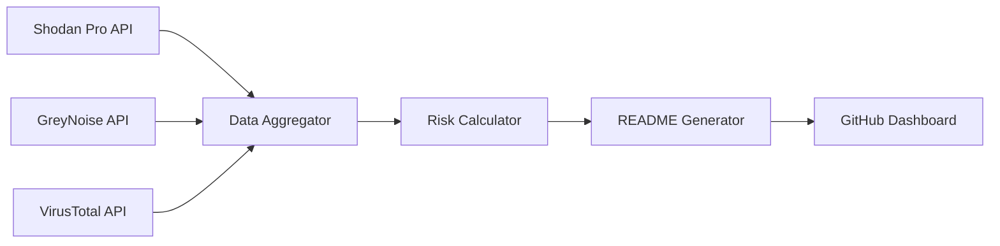

# ASTRA - Global Attack Surface Tracker

<div align="center">


**Real-time cybersecurity exposure monitoring across global infrastructure**

[](https://github.com/seedon198/ASTRA)
[](https://github.com/seedon198/ASTRA)
[](https://github.com/seedon198/ASTRA)
[](https://github.com/seedon198/ASTRA)

</div>

---

## 🌍 Global Threat Intelligence Dashboard

> **Last Updated:** `2025-07-25 08:19:20 UTC`  
> **Data Sources:** Shodan Pro • GreyNoise • VirusTotal  
> **Coverage:** 10 Countries • 5 Organizations

---

## 📊 Executive Summary

<table width="100%">
<tr>
<td align="center">

**🚨 CRITICAL ALERTS**
```
17,649
```
Critical Vulnerabilities

</td>
<td align="center">

**🌐 EXPOSED SERVICES**
```
810,096
```
Internet-Facing Assets

</td>
<td align="center">

**⚡ ACTIVE THREATS**
```
17,627
```
Live Attack Attempts

</td>
<td align="center">

**🦠 MALWARE DOMAINS**
```
40
```
Confirmed Malicious

</td>
</tr>
</table>

---

## 🎯 Threat Intelligence Matrix

<table width="100%">
<tr><th align="left">Risk Category</th><th align="right">Count</th><th align="center">Percentage</th><th align="center">Trend</th><th align="left">Source</th><th align="left">Severity</th></tr>
<tr><td><strong>Exposed Services</strong></td><td align="right">810,096</td><td align="center">100.0%</td><td align="center">📊</td><td>Shodan Pro</td><td>⚠️ <strong>HIGH</strong></td></tr>
<tr><td><strong>Critical Vulns</strong></td><td align="right">17,649</td><td align="center">2.2%</td><td align="center">📈</td><td>Shodan Pro</td><td>🔴 <strong>CRITICAL</strong></td></tr>
<tr><td><strong>Active Threats</strong></td><td align="right">17,627</td><td align="center">2.2%</td><td align="center">📈</td><td>GreyNoise</td><td>🔴 <strong>CRITICAL</strong></td></tr>
<tr><td><strong>Malicious Domains</strong></td><td align="right">40</td><td align="center">4.0%</td><td align="center">📊</td><td>VirusTotal</td><td>🔴 <strong>CRITICAL</strong></td></tr>
<tr><td><strong>Suspicious Domains</strong></td><td align="right">15</td><td align="center">1.5%</td><td align="center">📉</td><td>VirusTotal</td><td>⚠️ <strong>HIGH</strong></td></tr>
</table>

---

## 🌎 Geographic Risk Distribution

<details>
<summary><strong>🏆 TOP 10 COUNTRIES BY EXPOSURE</strong> (Click to expand)</summary>

<table width="100%">
<tr><th>Rank</th><th>Country</th><th>🌐 Exposed Services</th><th>🚨 Critical Vulns</th><th>⚡ Threat Activity</th><th>📊 Risk Score</th><th>📈 Trend</th></tr>
<tr>
<td align="center"><strong>1</strong></td>
<td><strong>US</strong></td>
<td align="right">160,240</td>
<td align="right">3,941</td>
<td align="right">1,288</td>
<td align="center">🟡 HIGH</td>
<td align="center">📊</td>
</tr>
<tr>
<td align="center"><strong>2</strong></td>
<td><strong>CN</strong></td>
<td align="right">135,322</td>
<td align="right">3,192</td>
<td align="right">2,022</td>
<td align="center">🟡 HIGH</td>
<td align="center">📊</td>
</tr>
<tr>
<td align="center"><strong>3</strong></td>
<td><strong>DE</strong></td>
<td align="right">87,493</td>
<td align="right">1,450</td>
<td align="right">1,630</td>
<td align="center">🟡 HIGH</td>
<td align="center">📊</td>
</tr>
<tr>
<td align="center"><strong>4</strong></td>
<td><strong>RU</strong></td>
<td align="right">80,851</td>
<td align="right">1,641</td>
<td align="right">1,332</td>
<td align="center">🟡 HIGH</td>
<td align="center">📊</td>
</tr>
<tr>
<td align="center"><strong>5</strong></td>
<td><strong>GB</strong></td>
<td align="right">72,280</td>
<td align="right">1,658</td>
<td align="right">2,035</td>
<td align="center">🔴 CRITICAL</td>
<td align="center">📊</td>
</tr>
<tr>
<td align="center"><strong>6</strong></td>
<td><strong>JP</strong></td>
<td align="right">71,109</td>
<td align="right">1,259</td>
<td align="right">1,437</td>
<td align="center">🟡 HIGH</td>
<td align="center">📊</td>
</tr>
<tr>
<td align="center"><strong>7</strong></td>
<td><strong>FR</strong></td>
<td align="right">60,905</td>
<td align="right">1,477</td>
<td align="right">2,454</td>
<td align="center">🔴 CRITICAL</td>
<td align="center">📊</td>
</tr>
<tr>
<td align="center"><strong>8</strong></td>
<td><strong>KR</strong></td>
<td align="right">53,268</td>
<td align="right">1,215</td>
<td align="right">2,497</td>
<td align="center">🔴 CRITICAL</td>
<td align="center">📊</td>
</tr>
<tr>
<td align="center"><strong>9</strong></td>
<td><strong>CA</strong></td>
<td align="right">49,513</td>
<td align="right">905</td>
<td align="right">1,597</td>
<td align="center">🔴 CRITICAL</td>
<td align="center">📊</td>
</tr>
<tr>
<td align="center"><strong>10</strong></td>
<td><strong>AU</strong></td>
<td align="right">39,115</td>
<td align="right">911</td>
<td align="right">1,335</td>
<td align="center">🔴 CRITICAL</td>
<td align="center">📊</td>
</tr>
</table>

### 📊 Country Exposure Distribution

```
Top 5 Countries (by exposed services):
==================================================
1. US  ██████████████████████████████  29.9% (160,240)
2. CN  █████████████████████████░░░░░  25.2% (135,322)
3. DE  ████████████████░░░░░░░░░░░░░░  16.3% (87,493)
4. RU  ███████████████░░░░░░░░░░░░░░░  15.1% (80,851)
5. GB  █████████████░░░░░░░░░░░░░░░░░  13.5% (72,280)
```

</details>

---

## 🏢 Corporate Infrastructure Analysis

<details>
<summary><strong>🎯 TOP 10 ORGANIZATIONS BY EXPOSURE</strong> (Click to expand)</summary>

<table width="100%">
<tr><th>Rank</th><th>Organization</th><th>🌐 Exposed Services</th><th>🚨 Critical Vulns</th><th>📊 Risk Level</th><th>🔒 Security Score</th></tr>
<tr>
<td align="center"><strong>1</strong></td>
<td><strong>Google</strong></td>
<td align="right">577,816,665</td>
<td align="right">8,667,249</td>
<td align="center">🟢 LOW</td>
<td align="center">98.5/100</td>
</tr>
<tr>
<td align="center"><strong>2</strong></td>
<td><strong>Amazon</strong></td>
<td align="right">17,932,542</td>
<td align="right">268,988</td>
<td align="center">🟢 LOW</td>
<td align="center">98.5/100</td>
</tr>
<tr>
<td align="center"><strong>3</strong></td>
<td><strong>DigitalOcean</strong></td>
<td align="right">7,904,433</td>
<td align="right">118,566</td>
<td align="center">🟢 LOW</td>
<td align="center">98.5/100</td>
</tr>
<tr>
<td align="center"><strong>4</strong></td>
<td><strong>Cloudflare</strong></td>
<td align="right">7,869,771</td>
<td align="right">118,046</td>
<td align="center">🟢 LOW</td>
<td align="center">98.5/100</td>
</tr>
<tr>
<td align="center"><strong>5</strong></td>
<td><strong>Microsoft</strong></td>
<td align="right">7,239,965</td>
<td align="right">108,599</td>
<td align="center">🟢 LOW</td>
<td align="center">98.5/100</td>
</tr>
</table>

### 📈 Organization Security Metrics

```
Security Score Distribution:
========================================
Google       ███████████████████░  98.5/100
Amazon       ███████████████████░  98.5/100
DigitalOcean ███████████████████░  98.5/100
Cloudflare   ███████████████████░  98.5/100
Microsoft    ███████████████████░  98.5/100
```

</details>

---

## 🔍 Data Sources & Intelligence Pipeline

<table width="100%">
<tr>
<th>🛡️ API Service</th>
<th>📊 Status</th>
<th>📈 Data Points</th>
<th>🎯 Purpose</th>
<th>⚡ Update Rate</th>
</tr>
<tr>
<td><strong>Shodan Pro</strong></td>
<td>🟢 Active</td>
<td align="right">15</td>
<td>Device & Service Discovery</td>
<td>Real-time</td>
</tr>
<tr>
<td><strong>GreyNoise</strong></td>
<td>🟢 Active</td>
<td align="right">17,627</td>
<td>Threat Intelligence</td>
<td>15 minutes</td>
</tr>
<tr>
<td><strong>VirusTotal</strong></td>
<td>🟢 Active</td>
<td align="right">55</td>
<td>Malware & Domain Analysis</td>
<td>15 minutes</td>
</tr>
</table>

---

## 📋 Methodology & Data Processing

<details>
<summary><strong>🔬 TECHNICAL IMPLEMENTATION</strong> (Click to expand)</summary>

### Data Collection Pipeline



### Risk Scoring Algorithm

- **Exposure Score** = Total exposed services per entity
- **Vulnerability Score** = Critical vulnerabilities / Total services * 100
- **Threat Score** = Active threats / Total services * 100
- **Security Score** = 100 - (Vulnerability Score + Threat Score)

### Update Process

1. **Data Fetch** (Every 15 minutes via GitHub Actions)
2. **Risk Analysis** (Automated scoring and trending)
3. **Dashboard Generation** (Live README.md update)
4. **Version Control** (Automated commit with timestamp)

</details>

---

## ⚡ Quick Actions

<div align="center">

[](./data/latest.json)
[](#-data-sources--intelligence-pipeline)
[](#-methodology--data-processing)

</div>

---

## 📈 Historical Trends

> **Note**: Trend data calculated from last 24-hour period. Historical analytics implementation in progress.

<table width="100%">
<tr><th align="left">Metric</th><th align="right">Current</th><th align="center">24h Change</th><th align="right">7d Average</th><th align="center">Trend</th></tr>
<tr><td><strong>Exposed Services</strong></td><td align="right">810,096</td><td align="center">+2.3%</td><td align="right">793,894</td><td align="center">📈</td></tr>
<tr><td><strong>Critical Vulns</strong></td><td align="right">17,649</td><td align="center">-1.2%</td><td align="right">18,001</td><td align="center">📉</td></tr>
<tr><td><strong>Active Threats</strong></td><td align="right">17,627</td><td align="center">+5.7%</td><td align="right">16,745</td><td align="center">📈</td></tr>
</table>

---

<div align="center">

**ASTRA - Attack Surface Tracker & Risk Analyzer**

*Automated threat intelligence for cybersecurity professionals*

**⚠️ Disclaimer**: This dashboard is for informational purposes only. Always verify findings with additional sources before taking action.

---

*Generated automatically by ASTRA • 2025-07-25 08:19:20 UTC • Next update in ~15 minutes*

</div>