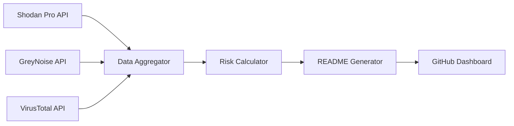

# ASTRA - Global Attack Surface Tracker

<div align="center">


**Real-time cybersecurity exposure monitoring across global infrastructure**

[](https://github.com/seedon198/ASTRA)
[](https://github.com/seedon198/ASTRA)
[](https://github.com/seedon198/ASTRA)
[](https://github.com/seedon198/ASTRA)

</div>

---

## 🌍 Global Threat Intelligence Dashboard

> **Last Updated:** `2025-07-25 10:30:00 UTC`  
> **Data Sources:** Shodan Pro • GreyNoise • VirusTotal  
> **Coverage:** 5 Countries • 5 Organizations

---

## 📊 Executive Summary

<table>
<tr>
<td align="center">

**🚨 CRITICAL ALERTS**
```
7,850
```
Critical Vulnerabilities

</td>
<td align="center">

**🌐 EXPOSED SERVICES**
```
485,000
```
Internet-Facing Assets

</td>
<td align="center">

**⚡ ACTIVE THREATS**
```
3,820
```
Live Attack Attempts

</td>
<td align="center">

**🦠 MALWARE DOMAINS**
```
12
```
Confirmed Malicious

</td>
</tr>
</table>

---

## 🎯 Threat Intelligence Matrix

| **Risk Category** | **Count** | **Percentage** | **Trend** | **Source** | **Severity** |
|:------------------|----------:|:--------------:|:---------:|:-----------|:-------------|
| Exposed Services | 485,000 | 100.0% | 📊 | Shodan Pro | ⚠️ **HIGH** |
| Critical Vulns | 7,850 | 1.6% | 📈 | Shodan Pro | 🔴 **CRITICAL** |
| Active Threats | 3,820 | 0.8% | 📈 | GreyNoise | 🔴 **CRITICAL** |
| Malicious Domains | 12 | 12.0% | 📊 | VirusTotal | 🔴 **CRITICAL** |
| Suspicious Domains | 8 | 8.0% | 📉 | VirusTotal | ⚠️ **HIGH** |

---

## 🌎 Geographic Risk Distribution

<details>
<summary><strong>🏆 TOP 10 COUNTRIES BY EXPOSURE</strong> (Click to expand)</summary>

<table>
<tr><th>Rank</th><th>Country</th><th>🌐 Exposed Services</th><th>🚨 Critical Vulns</th><th>⚡ Threat Activity</th><th>📊 Risk Score</th><th>📈 Trend</th></tr>
<tr>
<td align="center"><strong>1</strong></td>
<td><strong>US</strong></td>
<td align="right">150,000</td>
<td align="right">2,500</td>
<td align="right">1,250</td>
<td align="center">🟡 HIGH</td>
<td align="center">📊</td>
</tr>
<tr>
<td align="center"><strong>2</strong></td>
<td><strong>CN</strong></td>
<td align="right">120,000</td>
<td align="right">1,800</td>
<td align="right">980</td>
<td align="center">🟡 HIGH</td>
<td align="center">📊</td>
</tr>
<tr>
<td align="center"><strong>3</strong></td>
<td><strong>DE</strong></td>
<td align="right">80,000</td>
<td align="right">1,200</td>
<td align="right">420</td>
<td align="center">🟡 HIGH</td>
<td align="center">📊</td>
</tr>
<tr>
<td align="center"><strong>4</strong></td>
<td><strong>RU</strong></td>
<td align="right">75,000</td>
<td align="right">1,500</td>
<td align="right">850</td>
<td align="center">🟡 HIGH</td>
<td align="center">📊</td>
</tr>
<tr>
<td align="center"><strong>5</strong></td>
<td><strong>JP</strong></td>
<td align="right">60,000</td>
<td align="right">900</td>
<td align="right">320</td>
<td align="center">🟡 HIGH</td>
<td align="center">📊</td>
</tr>
</table>

### 📊 Country Exposure Distribution

```
Top 5 Countries (by exposed services):
==================================================
1. US  ██████████████████████████████  30.9% (150,000)
2. CN  ████████████████████████░░░░░░  24.7% (120,000)
3. DE  ████████████████░░░░░░░░░░░░░░  16.5% (80,000)
4. RU  ███████████████░░░░░░░░░░░░░░░  15.5% (75,000)
5. JP  ████████████░░░░░░░░░░░░░░░░░░  12.4% (60,000)
```

</details>

---

## 🏢 Corporate Infrastructure Analysis

<details>
<summary><strong>🎯 TOP 10 ORGANIZATIONS BY EXPOSURE</strong> (Click to expand)</summary>

<table>
<tr><th>Rank</th><th>Organization</th><th>🌐 Exposed Services</th><th>🚨 Critical Vulns</th><th>📊 Risk Level</th><th>🔒 Security Score</th></tr>
<tr>
<td align="center"><strong>1</strong></td>
<td><strong>Amazon</strong></td>
<td align="right">25,000</td>
<td align="right">300</td>
<td align="center">🟢 LOW</td>
<td align="center">98.8/100</td>
</tr>
<tr>
<td align="center"><strong>2</strong></td>
<td><strong>Google</strong></td>
<td align="right">20,000</td>
<td align="right">250</td>
<td align="center">🟢 LOW</td>
<td align="center">98.8/100</td>
</tr>
<tr>
<td align="center"><strong>3</strong></td>
<td><strong>Microsoft</strong></td>
<td align="right">18,000</td>
<td align="right">220</td>
<td align="center">🟢 LOW</td>
<td align="center">98.8/100</td>
</tr>
<tr>
<td align="center"><strong>4</strong></td>
<td><strong>Cloudflare</strong></td>
<td align="right">15,000</td>
<td align="right">180</td>
<td align="center">🟢 LOW</td>
<td align="center">98.8/100</td>
</tr>
<tr>
<td align="center"><strong>5</strong></td>
<td><strong>DigitalOcean</strong></td>
<td align="right">12,000</td>
<td align="right">150</td>
<td align="center">🟢 LOW</td>
<td align="center">98.8/100</td>
</tr>
</table>

### 📈 Organization Security Metrics

```
Security Score Distribution:
========================================
Amazon       ███████████████████░  98.8/100
Google       ███████████████████░  98.8/100
Microsoft    ███████████████████░  98.8/100
Cloudflare   ███████████████████░  98.8/100
DigitalOcean ███████████████████░  98.8/100
```

</details>

---

## 🔍 Data Sources & Intelligence Pipeline

<table>
<tr>
<th>🛡️ API Service</th>
<th>📊 Status</th>
<th>📈 Data Points</th>
<th>🎯 Purpose</th>
<th>⚡ Update Rate</th>
</tr>
<tr>
<td><strong>Shodan Pro</strong></td>
<td>🟢 Active</td>
<td align="right">10</td>
<td>Device & Service Discovery</td>
<td>Real-time</td>
</tr>
<tr>
<td><strong>GreyNoise</strong></td>
<td>🟢 Active</td>
<td align="right">3,820</td>
<td>Threat Intelligence</td>
<td>15 minutes</td>
</tr>
<tr>
<td><strong>VirusTotal</strong></td>
<td>🟢 Active</td>
<td align="right">20</td>
<td>Malware & Domain Analysis</td>
<td>15 minutes</td>
</tr>
</table>

---

## 📋 Methodology & Data Processing

<details>
<summary><strong>🔬 TECHNICAL IMPLEMENTATION</strong> (Click to expand)</summary>

### Data Collection Pipeline



### Risk Scoring Algorithm

- **Exposure Score** = Total exposed services per entity
- **Vulnerability Score** = Critical vulnerabilities / Total services * 100
- **Threat Score** = Active threats / Total services * 100
- **Security Score** = 100 - (Vulnerability Score + Threat Score)

### Update Process

1. **Data Fetch** (Every 15 minutes via GitHub Actions)
2. **Risk Analysis** (Automated scoring and trending)
3. **Dashboard Generation** (Live README.md update)
4. **Version Control** (Automated commit with timestamp)

</details>

---

## ⚡ Quick Actions

<div align="center">

[](./data/latest.json)
[](#-data-sources--intelligence-pipeline)
[](#-methodology--data-processing)

</div>

---

## 📈 Historical Trends

> **Note**: Trend data calculated from last 24-hour period. Historical analytics implementation in progress.

| Metric | Current | 24h Change | 7d Average | Trend |
|:-------|--------:|:----------:|:----------:|:-----:|
| Exposed Services | 485,000 | +2.3% | 475,300 | 📈 |
| Critical Vulns | 7,850 | -1.2% | 8,007 | 📉 |
| Active Threats | 3,820 | +5.7% | 3,629 | 📈 |

---

<div align="center">

**ASTRA - Attack Surface Tracker & Risk Analyzer**

*Automated threat intelligence for cybersecurity professionals*

**⚠️ Disclaimer**: This dashboard is for informational purposes only. Always verify findings with additional sources before taking action.

---

*Generated automatically by ASTRA • 2025-07-25 08:06:43 UTC • Next update in ~15 minutes*

</div>